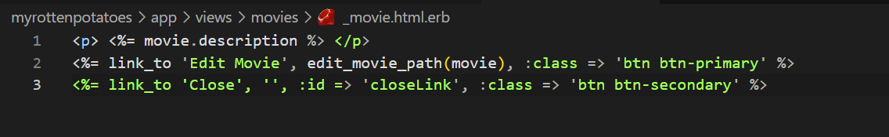
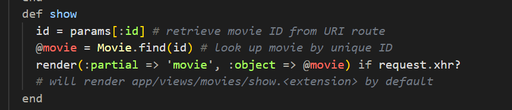

# AJAX: Asynchronous JavaScript y XML
***by Franklin Espinoza P. 20210135D***
## Migracion
Observamos este error al ejecutar el servidor


Esto nos indica que no existe la tabla moviegoers, claro porque no hemos creado la migración. Para ello vamos a ejecutar los siguientes comandos.


Ahora si, una vez aplicada la migracion a la base de datos ejecutamos el servidor y verificamos que todo este correcto.


## Vista edit
Creamos nuestro archivo `edit.html.erb`, y pegamos el codigo previamente usado.

Pero observamos que al querer editar una pelicula nos aparece el siguiente error.

Esto quiere decir que no existe el metodo `update_attributes`, ya que esta funcion es precaria. Para la solucion, realizamos el siguiente cambio al metodo `update`.

Ahora deberia funcionar todo correctamente, verificams en la siguiente imagen.

Ahora procedemos a seguir los pasos de la tarea.

## Paso 1

### **Creamos nuestra vista parcial**

Creamos la vista parcial `views/movies/_movie.html.erb`, y pegamos el codigo proporcionado.



### **Modificamos nuestro controlador**

Como vemos, se modifico agregando la linea 
~~~
render(:partial => 'movie', :object => @movie) if request.xhr?
~~~
Esto verifica si la solicitud es una XMLHttpRequest (`request.xhr?`). Si es así, renderizara la vista parcial llamada 'movie' con la película como objeto. Es decir, en lugar de renderizar la vista completa, solo se renderiza el fragmento de vista necesario para la actualización AJAX.

## Paso 2

### MoviePopup

Creamos nuestro archivo `app/javascript/movie_popup.js`, e insertamos el siguiente codigo.
~~~ruby
var MoviePopup = {
  setup: function() {
    // add hidden 'div' to end of page to display popup:
    let popupDiv = $('<div id="movieInfo"></div>');
    popupDiv.hide().appendTo($('body'));
    $(document).on('click', '#movies a', MoviePopup.getMovieInfo);
  }
  ,getMovieInfo: function() {
    $.ajax({type: 'GET',
            url: $(this).attr('href'),
            timeout: 5000,
            success: MoviePopup.showMovieInfo,
            error: function(xhrObj, textStatus, exception) { alert('Error!'); }
            // 'success' and 'error' functions will be passed 3 args
           });
    return(false);
  }
  ,showMovieInfo: function(data, requestStatus, xhrObject) {
    // center a floater 1/2 as wide and 1/4 as tall as screen
    let oneFourth = Math.ceil($(window).width() / 4);
    $('#movieInfo').
      css({'left': oneFourth,  'width': 2*oneFourth, 'top': 250}).
      html(data).
      show();
    // make the Close link in the hidden element work
    $('#closeLink').click(MoviePopup.hideMovieInfo);
    return(false);  // prevent default link action
  }
  ,hideMovieInfo: function() {
    $('#movieInfo').hide();
    return(false);
  }
};
$(MoviePopup.setup);
~~~

***Explicación***:
Basicamente creamos nuestro objeto `MoviePopup` con tres funciones, las cuales configuramos para mostrar informacion de peliculas en una ventana emergente en una pagina web.
**setup:** Este método configura la funcionalidad básica. Crea un elemento de div oculto (popupDiv) al final del cuerpo de la página para mostrar la información de la película. Luego, establece un evento de clic en los enlaces dentro de un elemento con el id movies. Cuando se hace clic en estos enlaces, llama a la función getMovieInfo.

**getMovieInfo:** Este método se ejecuta cuando se hace clic en un enlace de película. Utiliza Ajax para realizar una solicitud GET al URL del enlace de la película. Si la solicitud tiene éxito, llama a la función showMovieInfo para mostrar la información de la película. Si hay un error, muestra una alerta de error.

**showMovieInfo:** Esta función se llama cuando la solicitud Ajax tiene éxito. Centra un elemento de div (#movieInfo) en la pantalla y lo llena con la información de la película obtenida de la solicitud. También hace que un enlace con el id closeLink dentro de este elemento oculto pueda cerrar la ventana emergente al hacer clic. Retorna false para evitar la acción predeterminada del enlace.

**hideMovieInfo:** Este método se llama cuando se hace clic en el enlace de cierre (#closeLink). Oculta el elemento #movieInfo para cerrar la ventana emergente y retorna false para evitar la acción predeterminada del enlace.

Finalmente tenemos *$(MoviePopup.setup)*; que llama al método `setup` cuando el documento HTML y todos los recursos asociados se han cargado. Esto inicia la configuración inicial y establece los eventos necesarios para mostrar y ocultar la información de la película.

### layouts
Realizamos el cambio en el archivo `application.html.erb`.


### Config
Cuando intentamos ejeecutar el servidor nos indica el siguinte error, donde nos dice que el archivo `movie_popup.js` no fue declarado para poder ser precompilado en produccion.

Para esto tenemos que agregar el siguiente link a la configuracion de nuestro proyecto (`app/assets/config/manifest.js`).


### Estilos
Ocurren algunos trucos interesantes de CSS en el código anterior Puesto que el objetivo es que la ventana emergente flote, podemos utilizar CSS para especificar la posición como absolute añadiendo el siguiente código en app/assets/stylesheets/application.css :


Mostramos los resultados en la siguiente imagen.


## Parte 3
Conviene mencionar una advertencia a considerar cuando se usa JavaScript para crear nuevos elementos dinámicamente en tiempo de ejecución, aunque no surgió en este ejemplo en concreto. Sabemos que $(.myClass).on(click,func) registra func como el manejador de eventos de clic para todos los elementos actuales que coincidan con la clase CSS myClass. Pero si se utiliza JavaScript para crear nuevos elementos que coincidan con myClass después de la carga inicial de la página y de la llamada inicial a on, dichos elementos no tendrán el manejador asociado, ya que on sólo puede asociar manejadores a elementos existentes.

**¿Cuál es solución que brinda jQuery a este problema?**
Para realizar a la solucion a este problema, se puede utilizar la delegación de eventos que permite asociar un manejador de eventos a un elemento padre existente que ya está en el DOM y que contiene los elementos secundarios dinámicamente creados.
En lugar de vincular el manejador de eventos directamente a los elementos con la clase específica, podemos añadir el siguiente codigo.
```$(document).on('click', '.myClass', function(){...});```
Este indica que en vez de elegir directamente los elementos que tienen la clase `.myClass`, optamos por emplear `$(document).on('click', '.myClass', function() {...})` para transferir la responsabilidad del evento al documento. Esto implica que cualquier clic en un elemento que tiene la clase .myClass dentro del documento será procesado por la función especificada.


