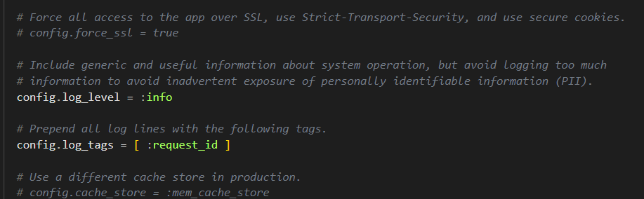

# Depuracion SaaS que usan Rails 
*by: Franklin Espinoza Pari*
## Depuracion en casos de Fallos

**Búsqueda del Error:** 
Podemos utilizar motores de busqueda como Google o sitios web de desarrollo como StackOverflow para buscar mensajes de error específicos.

**Publicación de Preguntas:**
Si la búsqueda no proporciona una solución, podemos intentar publicar preguntas detalladas sobre el problema en sitios como 'StackOverflow'. Para obtener una respuesta rapida y acertada es necesaria brindar información específica sobre el problema, el entorno de desarrollo y cómo reproducir el problema.

## Primera forma de depurar
Hacemos el cambio en nuestra vista

De nuestra siguiente funcion `show` del controlador hemos agregado lo siguiente

- `raise params.inspect`: Detiene la ejecucion y muestra la descripcion detallada de los parametros (`params`) cuando ocurre una excepcion.

- `logger.debug("Descripcion detallada de pelicula: #{@movie.inspect}")`: Utilizamos `logger.debug` para poder imprimir la descripcion detallada de `@movie` en el archivo de registro.

- `rescue => excep`: El bloque `begin ... end` contiene el codigo que puede generar una excepcion, cuando pasa esto se captura en la variable `excep`, luego hacemos la impresion del mensaje de depuracion `logger.debug(Mensaje de depuracion: {excep.message})`

## Comparar Configuraciones de Entornos (`production.rb` vs `development.rb`):
### Entorno de Producción
Veamos la siguiente linea de codigo `config.log_level = :info`, este establece el nivel de registro para los mensajes de registros (logs) de la aplicacion en el *entorno de produccion*. El nivel de registro `:info` incluye los mensajes informativos y superiores. Es decir se registraran los mensajes de nivel `:info`, `:warn`, `:error` y `:fatal`. Los mensajes de nivel `:debug` no seran registrados.

### Entorno de Desarrollo
No aparece en la configuracion del *entorno de desarrollo*, pero por defecto es lo siguiente `config.log_level = :debug`. Esto significa que se registrarán mensajes de todos los niveles, incluyendo `:debug`, `:info`, `:warn`, `:error`, y `:fatal`. En desarrollo, esto es util ya que los mensajes de depuracion nos ayudan a entender completamente el flujo de ejecución y detectar posibles problemas durante el desarrollo.

## Segunda forma de depurar

Usaremos la gema `byebug` para poder establecer puntos de interrupción (`breakpoints`) y pasar a traves del codigo.
La instalamos ejecutando lo siguiente 
~~~
$ gem install byebug
~~~
A continuacion, vemos el cambio en el metodo `show` del controlador.

Tan pronto como la aplicación llame al método byebug, el debugger se iniciará en una shell de debbug dentro de la ventana de terminal donde lanzó el servidor de aplicaciones, y se colocará en el prompt del debugger (byebug). Antes de la solicitud, se mostrará el código alrededor de la línea que está a punto de ejecutarse y la línea actual se marcará con `=>`, así:

Cuando ocurre esto por una solicitud del navegador, la pestaña del navegador que contiene la solicitud se congelará hasta que el depurador haya terminado y el trace haya terminado de procesar toda la solicitud.
