# Parte 01
- - -
## Agrega un campo Director a Movies (1 punto)

1. No es necesario agregar los atributos en la clase modelo, ya que estos al ser creados estan implicitos en el mismo.

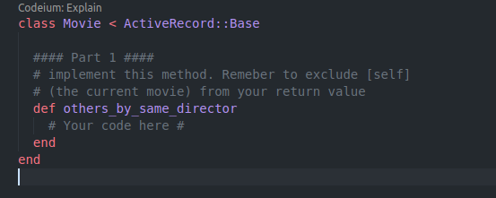

A continuacion, se muestra una creacion de una pelicula con un director utilizando la consola en rails, esto para poder verificar lo anterior y la migracion realizada.


2. A continuacion, observamos los escenarios:

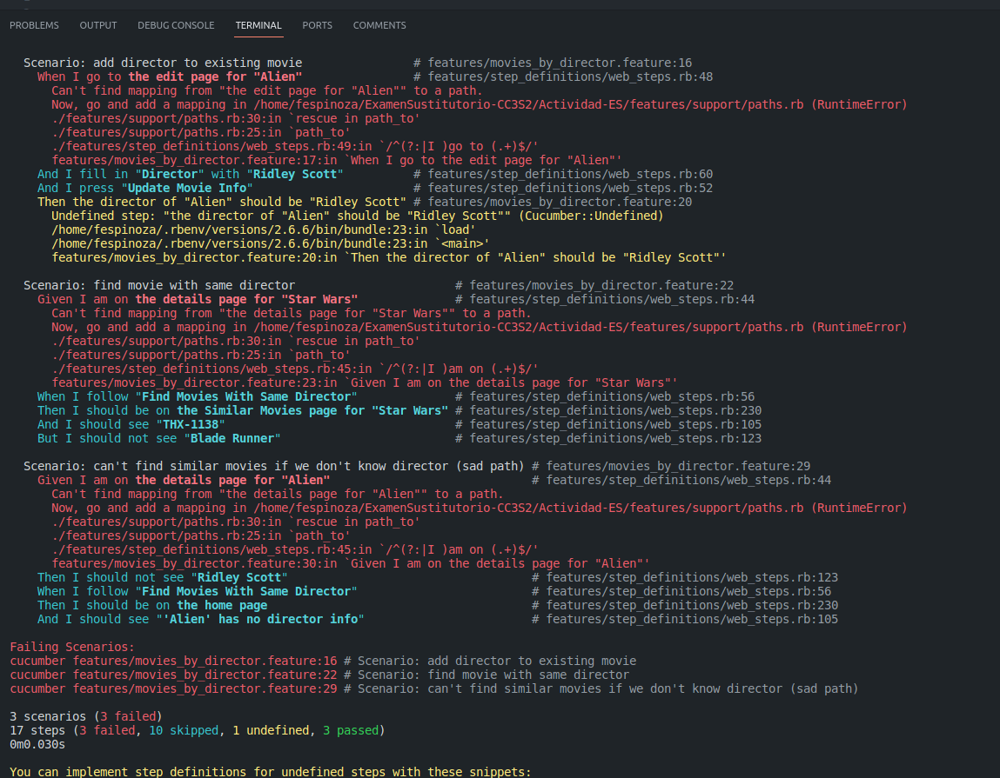  

Estas definiciones de los pasos lo encontramos en el archivo `features/step_definitios/movie_steps`.

3. El escenario 'add director to existing movie', este escenario falla ya que no existe un mapeo definido para el paso 'I go to the edit page 'Alien''. Vamos a necesitar que agregar un mapeo para este paso en el archivo `path.rb`.

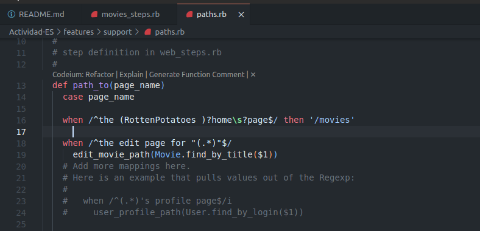

4. Tendremos que modificar las vistas, y ademas el controlador movies en los metodos siguientes. 

+ Vamos a primero modificar la accion `create`, esto para manejar el nuevo campo "director".

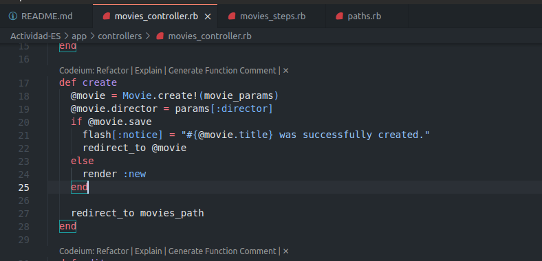

+ Luego vamos a modificar la accion `update`, para poder actualizar correctamente nuestra pelicula con el nuevo atributo "director".

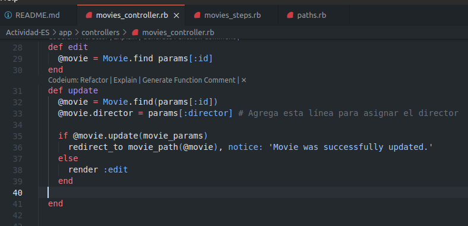

Acontinuacion vamos a modificar las vistas para poder realizar la creacion y edicion de peliculas, para poder incluir un capo de entrada para "director".

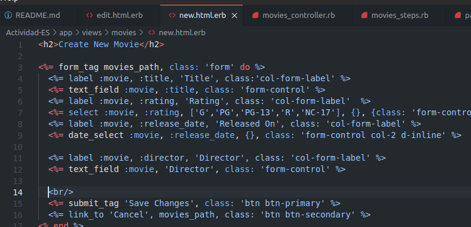

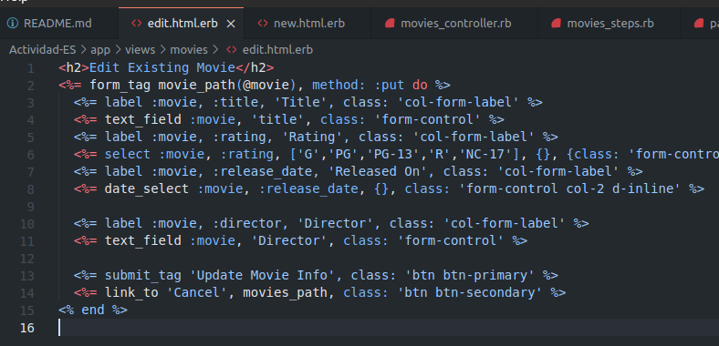

5. Si no realizamos los cambios anteriores, pues el valor de director estaria en nil dado que no lograriamos editar, crear, o actualizar una pelicula con el campo "director" y no se guardaria en nuestra base de datos.

A continuacion se muestran los resultados, ejecutando el servidor:

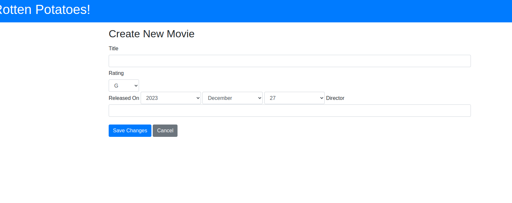


## Utiliza pruebas de aceptación para aprobar nuevos escenarios (2 puntos)

## Cobertura del código (1 punto)

- - -
# Parte 02
- - -
## Preguta 1 (1 punto): ¿Por qué la abstracción de un objeto de formulario pertenece a la capa de presentación y no a la capa de servicios (o inferior)?

- La abstracción de un objeto de formulario pertenece a la capa de presentación porque se refiere a la interacción y manipulación de datos específicos de la interfaz de usuario. La capa de presentación es responsable de recibir y validar la entrada del usuario, y los objetos de formulario se utilizan para representar estos datos y facilitar su procesamiento en la capa de presentación. Los objetos de formulario no están relacionados con la lógica de negocio o el almacenamiento de datos, por lo que su responsabilidad recae en la capa de presentación.

## Pregunta 2 (1 punto): ¿Cuál es la diferencia entre autenticación y autorización?

- La autenticación se refiere al proceso de verificar la identidad de un usuario, es decir, asegurarse de que el usuario sea quien dice ser. Por otro lado, la autorización se refiere a los permisos y privilegios que se le otorgan a un usuario una vez que se ha autenticado. La autorización determina qué acciones o recursos puede acceder un usuario específico.

## Pregunta 3 (2 puntos): Middleware

***¿Qué pasa si omite el middleware de Rack y se pasa la solicitud al enrutador directamente (Rails.application.routes.call(request))? ¿Qué pasa si se omitie el enrutador y llamar a una acción del controlador de inmediato (por ejemplo, PostsController.action(:index).call(request))?***

- Si omites el middleware de Rack y pasas directamente la solicitud al enrutador `(Rails.application.routes.call(request))`, estarías saltándote todos los middlewares que se ejecutan antes del enrutador. Esto significa que no se realizarían ciertas tareas y modificaciones que normalmente se hacen en los middlewares, como la autenticación, la manipulación de la respuesta o el registro de información. Por otro lado, si omites el enrutador y llamas directamente a una acción del controlador `(PostsController.action(:index).call(request))`, te saltarías el proceso de enrutamiento y cualquier middleware que se ejecute después del enrutamiento. Esto significa que no se realizaría ninguna verificación de rutas ni se ejecutarían los middlewares posteriores al enrutamiento, como la autorización o la manipulación de la respuesta.

***Utiliza trace_location  para realizar algunos experimentos y analizar los resultados.***

En el repositorio brindado nos pide primero instala la gema `gem install trace_location`, luego vamos a realizar los experimentos en nuestras acciones `create` y `edit`. Vamos agregar la siguiente linea en cada accion, tal como nos menciona el repositorio:


Se coloco el metodo `TraceLocation.trace(match: /activerecord/) { @movie.validate }`, despues de asignar el valor del director al objeto `@movie` y antes de llamar a los metodos save y update respectivamente para cada accion.

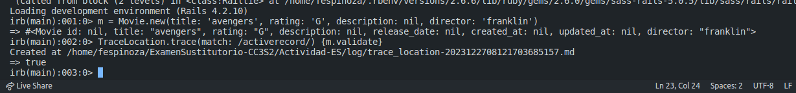

Esto nos permite rastrear y analizar el proceso de validacion de Active Record, en este caso al crear una nueva instancia de Movie. Como pueden ver nos crea el archivo `trace_location`. La cual nos muestra la secuencia de los metodos que son llamados en la libreria de Ruby on Rails Active Record.

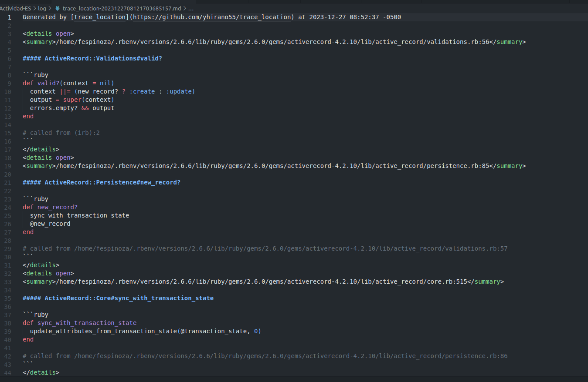

## Pregunta 4 (2 puntos): 

Nos piden crear un one-liner en UNIX que muestre los N primeros archivos en RUby complejos utilizando Flog, y luego que combine esta informacion con la calculadora de churn. Primero tenemos que instalar la gema, ejecutamos el comando `gem install flog` dentro de un repostiorio de trabajo.
```
fespinoza@fespinoza:~/CC3S2/ExamenSustitutorio-CC3S2/Actividad-ES$ gem install flog
Fetching path_expander-1.1.1.gem
Fetching sexp_processor-4.17.0.gem
Fetching flog-4.8.0.gem
Fetching ruby_parser-3.20.3.gem
Successfully installed path_expander-1.1.1
Successfully installed sexp_processor-4.17.0
Successfully installed ruby_parser-3.20.3
Successfully installed flog-4.8.0
Parsing documentation for path_expander-1.1.1
Installing ri documentation for path_expander-1.1.1
Parsing documentation for sexp_processor-4.17.0
Installing ri documentation for sexp_processor-4.17.0
Parsing documentation for ruby_parser-3.20.3
Installing ri documentation for ruby_parser-3.20.3
Parsing documentation for flog-4.8.0
Installing ri documentation for flog-4.8.0
Done installing documentation for path_expander, sexp_processor, ruby_parser, flog after 20 seconds
4 gems installed
```

Luego vamos a ver la complejidad de cada archivo en el modelo de nuestro repositorio, para eso vamos a ejecutar el siguietne comando y nos mostrara la salida , donde nos muestra las complejidades 6.8 y 3.4 para nuestro modelo `movie.rb`.

**OUTPUT**
```
fespinoza@fespinoza:~/CC3S2/ExamenSustitutorio-CC3S2/Actividad-ES$ find app/models -name "*.rb" -exec sh -c 'echo $(flog -s $1) $1' _ {} \;
6.8: flog total 3.4: flog/method average app/models/movie.rb
```

Luego vamos a caluclar el churn de cada archivo con Git.

**OUTPUT**
```
fespinoza@fespinoza:~/CC3S2/ExamenSustitutorio-CC3S2/Actividad-ES$ find . -name "*.rb" -exec flog {} + | sort -n | tail -n 4
    26.6: Then#/^the "([^"]*)" field should have no error$/ ./features/step_definitions/web_steps.rb:196-204
    44.9: Then#/^the "([^"]*)" field should have the error "([^"]*)"$/ ./features/step_definitions/web_steps.rb:165-191
   158.7: main#none
   584.3: flog total
```

El comando `find` `. -name "*.rb" -exec flog {} + | sort -n | tail -n 4 `analiza la complejidad del código de los archivos Ruby en el directorio actual y sus subdirectorios. Muestra los puntajes de complejidad de los métodos `Then#/^the "([^"]*)" field should have no error$/ `y `Then#/^the "([^"]*)" field should have the error "([^"]*)"$/ `en el archivo `web_steps.rb`. También muestra el puntaje de complejidad total de todos los métodos analizados.

- - -
# Parte 03: Javascript
- - -
## Pregunta 1 (2 punto)

Crea varias funciones que te permitirán interactuar con las cookies de la página, incluida la lectura de un valor de cookie por nombre, la creación de una nueva cookie usando un nombre y su configuración para una cantidad determinada de días, y la eliminación de una cookie. 

- Vamos a crear nuestro archivo `app/javascripts/cookies.js`, dentro de este vamos a crear nuestras funciones para poder leer un valor de una cookie por su nombre `getCookie(name)`, una funcion para poder crear una nueva cookie `setCookie(name, value, days)`, y finalmente una funcion para poder eliminar una cookie por su nombre `deleteCookie(name).

Configura tu página web y, en el código JavaScript, genera el valor de documento.cookie que debería estar en blanco. Intenta eliminar un cookie por su nombre. 

Tenemos que agregar la siguiente referencia al archivo javascript `<script src="cookies.js"></script>`, en nuestro encabezado de `application.html.erb` para que se muestre en todas nuestras vistas.

- - -
## Pregunta 3 (2 punto)

Puesto que el modelo Movie de RottenPotatoes requiere que el título de cada película sea distinto de la cadena vacía, el código JavaScript debería evitar que el formulario  “Add New Movie” se enviara si no se cumplen los criterios de validación, mostrar un mensaje de ayuda al usuario, y resaltar el(los) campo(s) del formulario que ocasionaron los problemas de validación. Gestiona, al menos, las validaciones integradas, como que los títulos sean distintos de cadena vacía, que las longitudes máxima y mínima de la cadena de caracteres sean correctas, que los valores numéricos estén dentro de los límites de los rangos, y para puntos adicionales, realice las validaciones basándose en expresiones regulares.

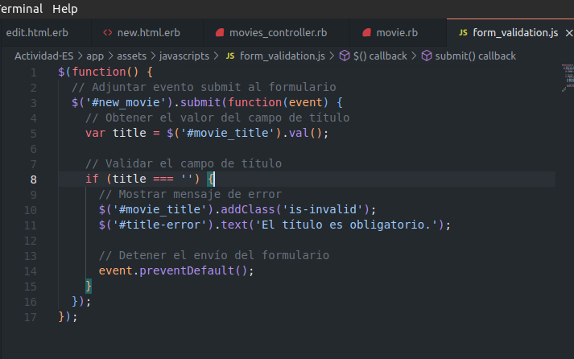


Lo que haces es que estamos seleccionando el formulario con el ID `new_movie` y adjuntando un evento `submit` a él. Dentro de la función de controlador de eventos, estamos obteniendo el valor del campo de título y validándolo. Si el título está vacío, agregamos una clase **is-invalid** al campo de título para resaltarlo y mostramos un mensaje de error en un elemento con el ID title-error. También detenemos el envío del formulario utilizando `event.preventDefault()`.

## Pregunta 4 (2 puntos)
Primero nos piden implementar el metodo `name_with_rating` en el modelo `Movie`, este nos va devolver una cadena con el titulo de la pelicula y su rating respectivo. Veremos un ejemplo a continuacion, donde vamos a utilizar el metodo, pero antes mostraremos la implementacion de la funcion en el modelo.
```ruby
def name_with_rating
    return "#{title} (#{rating})"
end
```

Luego nos hablan sobre los `Test Doubles`, vamos a simular la creacion de una instancia de la clase `Movie` con el metodo de Rspec `Double`. Este toma como primer argumento una cadena que simplemente es como un nombre o identificador para el objeto doble.

```ruby
# spec/fake_movie_spec.rb
require 'rails_helper.rb'

RSpec.describe Movie do
    describe "#name_with_rating" do
      it "returns the formatted name with rating" do
        fake_movie = double('Movie')

        allow(fake_movie).to receive(:title).and_return('Casablanca')
        allow(fake_movie).to receive(:rating).and_return('PG')
        
        expect(fake_movie.name_with_rating).to eq 'Casablanca (PG)'
      end
    end
end
```

Ahora probamos con el comando `bundle exec rake`:


Observamos que nos bota un error, es decir que llama al metodo correctamente pero existe un error de `no arguments` en el metodo. Puede que sea debido a que no estamos trabajando con una instancia real sino con un double object el cual no tiene un metodo `name_with_rating`. 

Ahora, para poder obtener una instancia real de la clase `Movie` para poder utilizar en la prueba, podemos utilizas los `fixtures` que son proporcionados en el archivo `movies.yml`.

```yml
# spec/fixtures/movies.yml
milk_movie:
    id: 1
    title: Milk
    rating: R
    release_date: 2008-11-26

documentary_movie:
    id: 2
    title: Food, Inc.
    release_date: 2008-09-07
```

Estos `fixtures` son datos ya predefinidos que se utilizan en las pruebas para poder crear objetos reales y probar el comportamiento de la clase `Movie`. 

Ahora, en nuestro archivo `movie_spec.rb`, utilizamos el `fixture` llamado `milk_movie` para poder obtener una instancia real de `Movie` y probar el metodo `name_with_rating`.
```ruby
# spec/models/movie_spec.rb:

require 'rails_helper.rb'


describe Movie do
    fixtures :movies
    it 'includes rating and year in full name' do
        movie = movies(:milk_movie)
        expect(movie.name_with_rating).to eq('Milk (R)')
    end
end
```

Ahora con todo lo dicho anteriormente, vamos a responder las preguntas que aparecen en nuestro ejercicio:

***1. ¿Dónde podemos conseguir una instancia de Movie real para utilizarla en dicha prueba?***

Esto ya lo habiamos mencionado, podemos conseguir una instancia de `Movie` real utilizando los `fixtures` definidos en el archivo `movies.yml` que mencionamos. En este codigo se utiliza el `fixture` `milk_movie` para poder obtener la instancia de `Movie`, y luego llamamos el metodo `name_with_rating` en la instancia para probar el resultado.

***2. ¿Qué hacen los siguientes códigos entregados y dónde se ubican?***

Esta pregunta la respondemos mas arriba, vamos a resumirlas.

* `movies.yml`: Archivo de fixtures que contiene datos predefinidos para obtener una instancia real de la clase `Movie`.
* `movie_spec.rb`: Aqui se defina las pruebas para la clase `Movie`, aqui utilizamos el fixture `milk_movie` para obtener la instancia de `Movie` y se prueba el metodo `name_with_rating`.

Ahora vamos a ejecutar la prueba, veremos que paso el test correctamente sin errores. Esto siginifica que el metodo `name_with_ratings` en la clase `Movie` se comporta como se espera y devuelve el valor correcto.

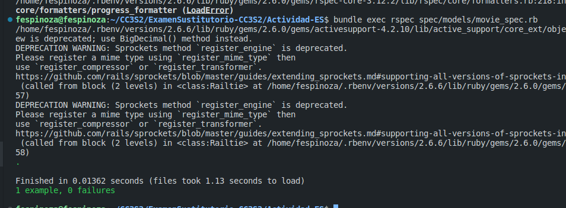

***Pros y contras del uso de factories o fixtures en las pruebas:***


El uso de fixtures en las pruebas tiene sus ventajas y desventajas, de las cuales vamos a mencionar algunas:
**Ventajas**:
* Facilitan la creacion de objetos validos para las pruebas, evitando la repeticion de codigo en la configuracion de los datos.
* Nos ayuda a mantener las pruebas mas limpias y legibles al separar la configuracion de datos de la logica de prueba.
* Nos proporciona un conjunto de datos predefinidos, el cual facilita la reproduccion de errores e identificacion de problemas.

**Contras**:
* Tenemos que tener cuidado, ya que pueden aumentar la complejidad y la dependencia de las pruebas en los datos de prueba externos.
* Si cambiamos el esquema de datos por ejemplo, estos van a requerir de una 'mantenimiento' para que vuelva a funcionar correctamente.
* Si se utilizan conjuntos de datos grandes pueden hacer que las pruebas se vuelvan lentas.

- - -
# Parte 4: Pruebas y Rspec (3 puntos)

En esta sección, se nos pide llevar a cabo pruebas en el sistema de puntuación de un juego de tenis. Para lograrlo, trabajaremos en un nuevo repositorio denominado `tennis_test`. Vamos a iniciar instalando la gema de Rspec, y vamos a ejecutar el comando `rails generate rspec:install`.
Ejecutaremos los siguientes comando en orden:

`rails new tennis_test`

Agregamos lo siguiente a nuestro `Gemfile`.
```ruby
group :development, :test do
  gem 'rspec-rails'
end
```
`bundle install`

`rails generate rspec"install`

**Salida**

```
fespinoza@fespinoza:~/CC3S2/ExamenSustitutorio-CC3S2/tennis_test$ rails generate rspec:install
      create  .rspec
      create  spec
      create  spec/spec_helper.rb
      create  spec/rails_helper.rb
```
Ahora vamos a crear un archivo de pruebas llamado `tennis_score_spec.rb` y pegaremos lo proporcionado en el ejercicio.
```ruby
RSpec.describe "TennisScorer" do
    describe "puntuación básica" do 
        it "empieza con un marcador de 0-0" 
        it "hace que el marcador sea 15-0 si el sacador gana un punto" 
        it "hace que el marcador sea 0-15 si el receptor gana un punto" 
        it "hace que el marcador sea 15-15 después de que ambos ganen un punto" 
     end
 end
```

Luego, vamos a ejecutar las pruebas con el comando `rspec tennis_score_spec.rb`.

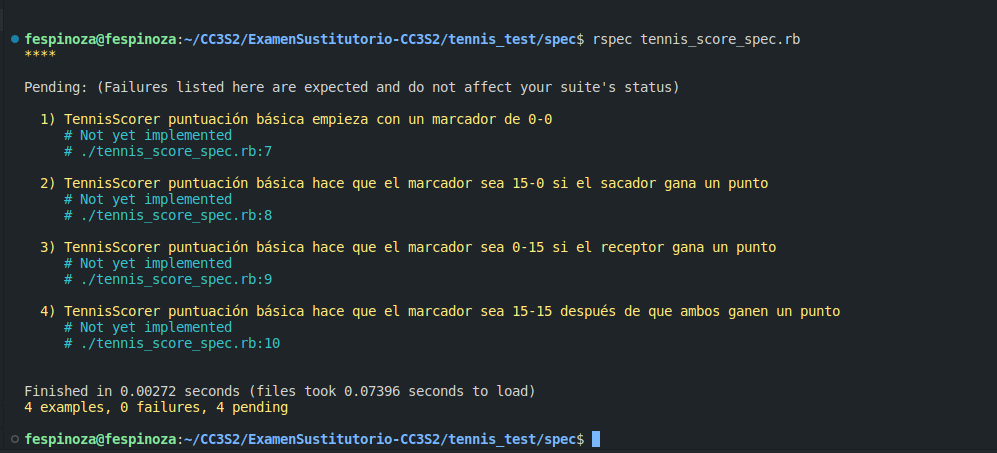

Observamos que las pruebas pueden ser identificadas y se marcan como pendientes. Ahora, procederemos a rellenar nuestra clase "TennisSoccer", incorporando los métodos necesarios. A continuación, se adjunta el código resuelto con los métodos requeridos. Con esto, estamos preparados para llevar a cabo las pruebas.

```ruby
class TennisScorer
    PLAYER_MAPPING = { server: :receiver, receiver: :server }
    SCORE_TRANSLATION = { 0 => 0, 1 => 15, 2 => 30, 3 => 40 }
  
    def initialize
        @default_player = :server
        @score = { server: 0, receiver: 0 }
    end
  
    # Devuelve la puntuación actual del jugador especificado
    def obtener_puntuacion(jugador = :server) 
        otro_jugador = PLAYER_MAPPING[jugador]
        if @score[jugador] <= 3 && @score[otro_jugador] <= 3
            if @score[jugador] == @score[otro_jugador] && @score[jugador] == 3
                'DEUCE' # Empate a 40-40
            else
                "#{SCORE_TRANSLATION[@score[:server]]}-#{SCORE_TRANSLATION[@score[:receiver]]}"
            end
        elsif @score[jugador] - @score[otro_jugador] >= 2
            "W-L" # El jugador ha ganado
        elsif @score[otro_jugador] - @score[jugador] >= 2
            "L-W" # El jugador ha perdido
        elsif @score[otro_jugador] >= 3 && @score[jugador] >= 3
            if @score[jugador] == @score[otro_jugador]
                "DEUCE" # Empate a 40-40
            elsif @score[jugador] > @score[otro_jugador]
                "El sacador tiene ventaja"
            else
                "El receptor tiene ventaja"
            end
        end
    end
  
    # Aumenta la puntuación del jugador especificado en 1
    def sumar_punto_a(jugador)
      @score[jugador] += 1
    end  
end
```

Ahora pasaremos a dar una breve explicacion del codigo anterior:


- Este código define una clase `TennisScorer` que realiza un seguimiento de la puntuación en un juego de tenis. Tiene un hash `PLAYER_MAPPING` que asigna los roles de los jugadores, un hash `SCORE_TRANSLATION` que asigna los valores de puntuación a sus descripciones correspondientes, y un método `initialize` que establece la puntuación inicial en 0 para ambos jugadores.
- El método `obtener_puntuacion` devuelve la puntuación actual para un jugador especificado. Verifica los valores de puntuación y determina la descripción adecuada según las reglas del tenis, como "DEUCE" para un empate a 40-40, "W-L" si el jugador ha ganado, "L-W" si el jugador ha perdido y descripciones para situaciones de ventaja.
- El método `sumar_punto_a` incrementa la puntuación del jugador especificado en 1.


Ahora vamos a proceder a complementar nuestras pruebas, como se vera en el siguiente codigo.
```ruby
require_relative "TennisScorer"

RSpec.describe "TennisScorer" do
    before(:each) do
        @tnss = TennisScorer.new
    end
    describe "puntuación básica" do
        it "empieza con un marcador de 0-0" do
            expect(@tnss.score).to eq("0-0")
        end
    
        it "hace que el marcador sea 15-0 si el sacador gana un punto" do
            @tnss.give_point_to(:saca)
            expect(@tnss.score).to eq("15-0")
        end
    
        it "hace que el marcador sea 0-15 si el receptor gana un punto" do
            @tnss.give_point_to(:recibe)
            expect(@tnss.score).to eq("0-15")
        end
    
        it "hace que el marcador sea 15-15 después de que ambos ganen un punto" do
            @tnss.give_point_to(:recibe)
            @tnss.give_point_to(:saca)
            expect(@tnss.score).to eq("15-15")
        end
    end
   end
```

Ahora pasamos a ejecutar las pruebas y verificamos que efectivamente se pasaron todas las pruebas. Veremos ahora la immpresion de cada prueba respectivamente en verde.

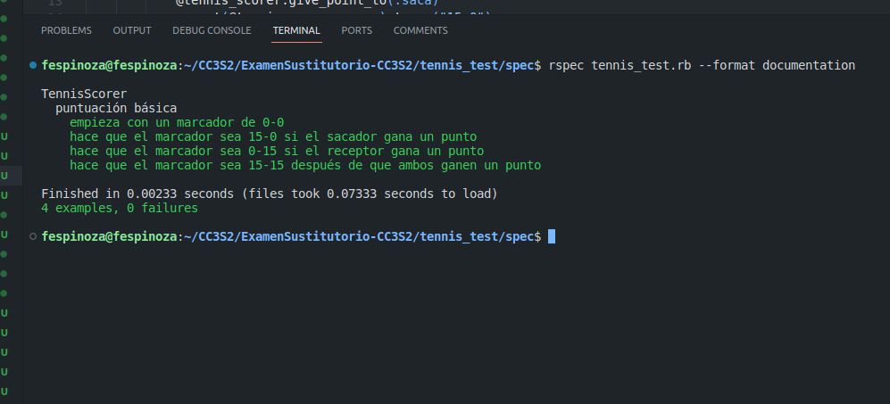

Además, se mencionan algunas pruebas adicionales que podríamos realizar, dado que nuestra clase TennisScorer ha sido diseñada de manera exhaustiva y está lista para abordar cualquier escenario posible. Por lo tanto, podríamos ejecutar todas las pruebas que se han implementado a continuación.

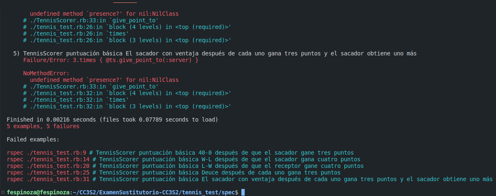


