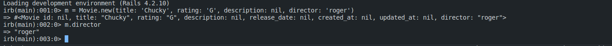
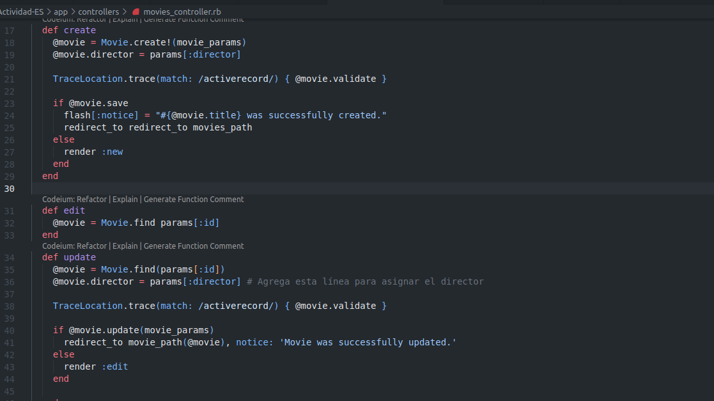

# Parte 01

## Agrega un campo Director a Movies (1 punto)

1. No es necesario agregar los atributos en la clase modelo, ya que estos al ser creados estan implicitos en el mismo.

A continuacion, se muestra una creacion de una pelicula con un director utilizando la consola en rails, esto para poder verificar lo anterior y la migracion realizada.

2. A continuacion, observamos los escenarios:

Estas definiciones de los pasos lo encontramos en el archivo `features/step_definitios/movie_steps`.

3. El escenario 'add director to existing movie', este escenario falla ya que no existe un mapeo definido para el paso 'I go to the edit page 'Alien''. Vamos a necesitar que agregar un mapeo para este paso en el archivo `path.rb`.

4. Tendremos que modificar las vistas, y ademas el controlador movies en los metodos siguientes. 

+ Vamos a primero modificar la accion `create`, esto para manejar el nuevo campo "director".

+ Luego vamos a modificar la accion `update`, para poder actualizar correctamente nuestra pelicula con el nuevo atributo "director".

Acontinuacion vamos a modificar las vistas para poder realizar la creacion y edicion de peliculas, para poder incluir un capo de entrada para "director".

5. Si no realizamos los cambios anteriores, pues el valor de director estaria en nil dado que no lograriamos editar, crear, o actualizar una pelicula con el campo "director" y no se guardaria en nuestra base de datos.

A continuacion se muestran los resultados, ejecutando el servidor:

## Utiliza pruebas de aceptación para aprobar nuevos escenarios (2 puntos)

## Cobertura del código (1 punto)

# Parte 02

## Preguta 1 (1 punto): ¿Por qué la abstracción de un objeto de formulario pertenece a la capa de presentación y no a la capa de servicios (o inferior)?

- La abstracción de un objeto de formulario pertenece a la capa de presentación porque se refiere a la interacción y manipulación de datos específicos de la interfaz de usuario. La capa de presentación es responsable de recibir y validar la entrada del usuario, y los objetos de formulario se utilizan para representar estos datos y facilitar su procesamiento en la capa de presentación. Los objetos de formulario no están relacionados con la lógica de negocio o el almacenamiento de datos, por lo que su responsabilidad recae en la capa de presentación.

## Pregunta 2 (1 punto): ¿Cuál es la diferencia entre autenticación y autorización?

- La autenticación se refiere al proceso de verificar la identidad de un usuario, es decir, asegurarse de que el usuario sea quien dice ser. Por otro lado, la autorización se refiere a los permisos y privilegios que se le otorgan a un usuario una vez que se ha autenticado. La autorización determina qué acciones o recursos puede acceder un usuario específico.

## Pregunta 3 (2 puntos): Middleware

***¿Qué pasa si omite el middleware de Rack y se pasa la solicitud al enrutador directamente (Rails.application.routes.call(request))? ¿Qué pasa si se omitie el enrutador y llamar a una acción del controlador de inmediato (por ejemplo, PostsController.action(:index).call(request))?***

- Si omites el middleware de Rack y pasas directamente la solicitud al enrutador `(Rails.application.routes.call(request))`, estarías saltándote todos los middlewares que se ejecutan antes del enrutador. Esto significa que no se realizarían ciertas tareas y modificaciones que normalmente se hacen en los middlewares, como la autenticación, la manipulación de la respuesta o el registro de información. Por otro lado, si omites el enrutador y llamas directamente a una acción del controlador `(PostsController.action(:index).call(request))`, te saltarías el proceso de enrutamiento y cualquier middleware que se ejecute después del enrutamiento. Esto significa que no se realizaría ninguna verificación de rutas ni se ejecutarían los middlewares posteriores al enrutamiento, como la autorización o la manipulación de la respuesta.

***Utiliza trace_location  para realizar algunos experimentos y analizar los resultados.***

En el repositorio brindado nos pide primero instala la gema `gem install trace_location`, luego vamos a realizar los experimentos en nuestras acciones `create` y `edit`. Vamos agregar la siguiente linea en cada accion, tal como nos menciona el repositorio:

Se coloco el metodo `TraceLocation.trace(match: /activerecord/) { @movie.validate }`, despues de asignar el valor del director al objeto `@movie` y antes de llamar a los metodos save y update respectivamente para cada accion.

Esto nos permite rastrear y analizar el proceso de validacion de Active Record, en este caso al crear una nueva instancia de Movie. Como pueden ver nos crea el archivo `trace_location`. La cual nos muestra la secuencia de los metodos que son llamados en la libreria de Ruby on Rails Active Record.

## Pregunta 4 (2 puntos): 

# Parte 03: Javascript

## Pregunta 1 (2 punto)

Crea varias funciones que te permitirán interactuar con las cookies de la página, incluida la lectura de un valor de cookie por nombre, la creación de una nueva cookie usando un nombre y su configuración para una cantidad determinada de días, y la eliminación de una cookie. 

- Vamos a crear nuestro archivo `app/javascripts/cookies.js`, dentro de este vamos a crear nuestras funciones para poder leer un valor de una cookie por su nombre `getCookie(name)`, una funcion para poder crear una nueva cookie `setCookie(name, value, days)`, y finalmente una funcion para poder eliminar una cookie por su nombre `deleteCookie(name).

Configura tu página web y, en el código JavaScript, genera el valor de documento.cookie que debería estar en blanco. Intenta eliminar un cookie por su nombre. 

Tenemos que agregar la siguiente referencia al archivo javascript ``, en nuestro encabezado de `application.html.erb` para que se muestre en todas nuestras vistas.

## Pregunta 3 (2 punto)

Puesto que el modelo Movie de RottenPotatoes requiere que el título de cada película sea distinto de la cadena vacía, el código JavaScript debería evitar que el formulario  “Add New Movie” se enviara si no se cumplen los criterios de validación, mostrar un mensaje de ayuda al usuario, y resaltar el(los) campo(s) del formulario que ocasionaron los problemas de validación. Gestiona, al menos, las validaciones integradas, como que los títulos sean distintos de cadena vacía, que las longitudes máxima y mínima de la cadena de caracteres sean correctas, que los valores numéricos estén dentro de los límites de los rangos, y para puntos adicionales, realice las validaciones basándose en expresiones regulares.

Lo que haces es que estamos seleccionando el formulario con el ID `new_movie` y adjuntando un evento `submit` a él. Dentro de la función de controlador de eventos, estamos obteniendo el valor del campo de título y validándolo. Si el título está vacío, agregamos una clase **is-invalid** al campo de título para resaltarlo y mostramos un mensaje de error en un elemento con el ID title-error. También detenemos el envío del formulario utilizando `event.preventDefault()`.

## Pregunta 4 (2 puntos)