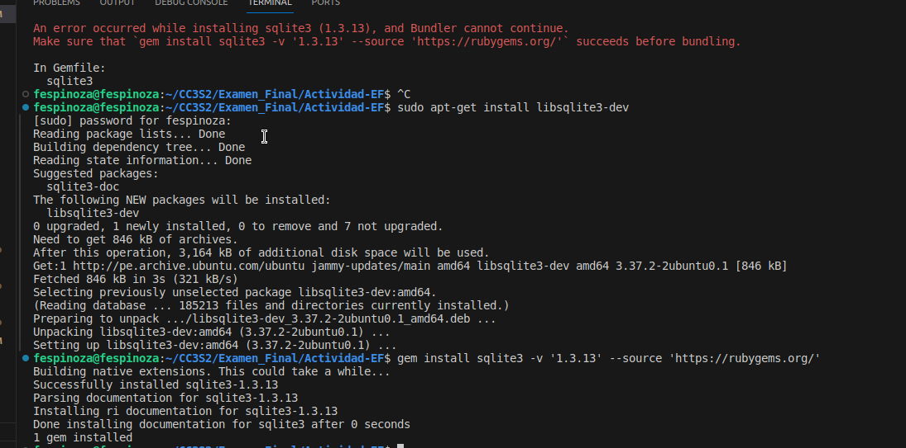
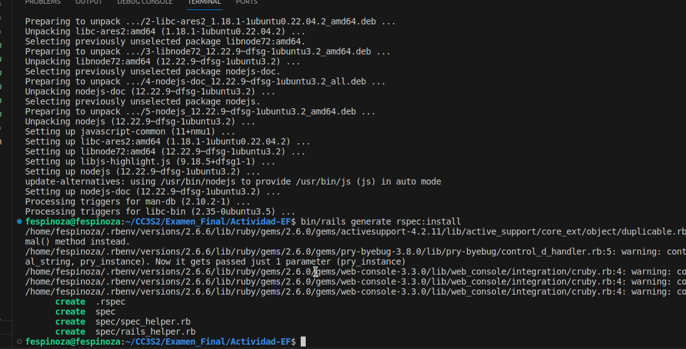

# Final
## Parte 1
### Pregunta 1
Produce un conflicto de fusión (merge) en algún repositorio de tus actividades realizadas. Establece los pasos y comandos que usas para resolver un conflicto de fusión en Git. Si intentas git push y falla con un mensaje como : Non-fast-forward (error): failed to push some refs esto significa que algún archivo contiene un conflicto de fusión entre la versión de tu repositorio y la versión del repositorio origen. Para este ejercicio debes presentar el conflicto dado, los pasos y comandos para resolver el problema y las solución. 

Primero creamos una nueva rama, pero hay que asegurarnos que nos encontramos en la rama `main`.


Vamos ahora a crear una nueva rama sobre la principal, en este caso vamos a modificar unas lineas de codigo de la actividad `Ruby On Rails Avanzado`. Utilizamos el comando `git branch roger`. Este nos crear una rama nombrada `roger`.


Ahora vamos a movernos a esa rama utilizando el comando `git checkout roger`.


 Para luego realizar los cambios en nuestro local, sobre la actividad mencionada. Lo que vamos a modificar sera la version de la gema ruby sobre el proyecto que se encuentra en el archivo `Gemfile`.
 Una vez hecho los cambios, vamos a realizar un commit a los cambios. Ahora vamos a movernos a la rama `main` y vamos a modificar la misma linea cambiando la version de ruby a `ruby 3.2.2`. Luego volvemos a nuestro branch `roger` y realizamos un merge.

 

 
Como podemos observar, existe un merge conflict por lo que nuestro merge falla. Para resolverlos, vamos a editar el archivo `Gemfile` manualmente, donde nos quedaremos con la version `3.2.2`.
 
 

 En el siguiente paso, realizamos un commit y vamos hacer un push sobre la rama principal `main`.

  

Finalmente, ahora verificamos los cambios en nuestro github

  


## Pregunta 2
Digamos que nos dan el modelo de `User` de la siguiente manera:  

```
class User < ActiveRecord::Base 

    validates :username, :presence => true 

    validate :username_format 

end 
```
1. Qué pasa si tenemos `@user` sin nombre de usuario y llamamos a `@user.valid`?? ¿Qué guardará `@user.save`?

Si `@user` no tiene un nombre de usuario y llamamos a @user.valid?, nos va retornar `false` porque la validación de presencia para username no se cumple. Si luego llamamos a `@user.save`, no guardará el objeto en la base de datos porque el objeto no es válido.

2. Implementa `username_format`. Para los propósitos, un nombre de usuario comienza con una letra y tiene como máximo 10 caracteres de largo. Recuerda, las validaciones personalizadas agregan un mensaje a la colección de errores. 

Se muestra a continuacion la implementacion.
```
class User < ActiveRecord::Base
    validates :username, presence: true
    validate :username_format

    private

    def username_format
        unless username =~ /\A[a-zA-Z][a-zA-Z0-9_]{,9}\z/
            errors.add(:username, 'debe comenzar con una letra y tener máximo 10 caracteres de largo')
        end
    end

end
```
Creamos una funcion privada `username_format`. Usaremos la palabra clave `unless` para validar que si es que se ingresa un usuario el cual no se ajusta con que comienze con una letra y que tenga como maximo 10 caracteres, entonces nos enviara un mensaje de error.

## Pregunta 3
Recuerda, los filtros nos ayudan a verificar si ciertas condiciones se cumplen antes de permitir que se ejecute una acción del controlador. Para el modelo de User, digamos que queremos verificar si @user era administrador de todos los métodos en AdminController. Completa el método before_filter:check_admin a continuación que verifica si el campo de administrador en @user es verdadero. De lo contrario, redirija a la página admin_login con un mensaje que indica acceso restringido. 

```
class AdminController < ApplicationController 

  	    before_filter :check_admin 

      # Completa el codigo 
```

Solucion, vamos a completar el codigo anterior de la siguiente manera.
```
class AdminController < ApplicationController
    before_action :check_admin

    private

    def check_admin
        unless @user&.admin?
            redirect_to admin_login_path, alert: 'Acceso restringido.'
        end
    end

end
```

Definimos un metodo privado `check_admin`, este quiere decir que no se puede hacer uso del mismo fuera de la clase. Luego vamos a volver a utilizar la palabra clave `unless` donde vamos a verificar que el usuario exsita y ademas que tenga un metodo `admin`. Si estas condiciones no se cumplen, el usuario se redirige a la página de inicio (`redirect_to admin_login_path`) de sesión del administrador con un mensaje de alerta (`alert: 'Acceso restringido.'`).

4.  AJAX (JavaScript y XML asíncronos) es un grupo de herramientas y técnicas para el desarrollo de aplicaciones web asíncronas. El objetivo de AJAX es que la comunicación entre una aplicación y el servidor de datos (es decir, solicitudes HTTP) no interfiera con la experiencia, la visualización y el comportamiento de la aplicación. A continuación, se te proporciona un formulario que simula el inicio de sesión. Comprueba si la combinación de nombre de usuario y contraseña funciona junto con la cuenta, si la hay. Para hacer eso, queremos que se realice una solicitud HTTP POST cuando se envíe este formulario. Escribe tu solución con jQuery y comenta dónde debe ubicarse la función de devolución de llamada (callback). Comprueba tus resultados. 

```
<form method="POST" id="foo"> 

<input type="text" class="user" /> 

<input type="password" class="pass" /> 

<input type="button" value="Log␣in" id="onSubmit" /> 

</form> 

$("#onSubmit").click(function() { 

# Tu codigo 

}) 
```


5. ¿Cuándo deberías utilizar la metaprogramación basada en eval en lugar de la metaprogramación basada en bloques?. 

Sabemos que la metaprogramacion basada en eval se utiliza para poder evaluar cadenas de texto, y es muy util cuando estamos trabajando con codigo que es generado dinamicamente como cadenas, que por ejemplo cargado de una base de datos. 

Y la metaprogramacion en bloques nos sirve para poder encapsular trozos de codigo que pueden ser almacenados en variables o pasados como argumentos en metodos.

Ahora bien, Cuando debemos usar eval en lugar de bloques? 
* Cuando el codigo que necesitas ejecutar se genera dinamicamente como una cadena y no puede ser convertida en un bloque de manera practica.
* Cuando necesitemos evaluar y ejecutar codigo Ruby que esta almacenado como texto, como archivos de configuracion.

Sin embargo, siempre se da preferencia a la metaprogramacion basada en bloques ya que la metaprogramacion basada en eval puede tiene riesgos de seguridad.

# Parte 02

Vamos a utilizar la carpeta que esta comprimida en la evaluacion `Actividad-EF`.
Para luego ejecutar `bundle install --without production` para configurar las dependencias del proyecto, a excepcion de las dependencias de produccion.

Al ejecutar el comando anterior obtenemos el siguiente error.


Este es un error muy comun de dependencias, para solucionarlo vamos a instalar las dependencias necesarias en nuestro ordenador para poder compilar la gema. Luego vamos a instalarlo manualmente.



Ahora observamos que se instalo correctamente las gemas al ejecutar nuevamente le comando `bundle install --without production`.


Ahora vamos anadir las gema `farday` para poder realizar llamadas. Vamos agregar lo siguiente a nuestro gemfile.
~~~
gem 'faraday'   
group :test do 
  gem 'rails-controller-testing' 
  gem 'guard-rspec'                  
end 
~~~
Ahora ejecutamos nuevamente `bundle install`, no es necesario el without ya que este lo recuerda.


Bien, funcion todo correctamente!. Ahora ejecutamos `rails generate rspec:install`

Este nos bota el siguiente error:


El cual nos dice que no se encontra `Javascript runtime`. Para esto vamos a instalar `nodejs` y luego volver a ejecutar el comando generador.



Ahora bien, vamos agregar la linea `require 'byebug'` en nuestro `spec/rails_helper.rb`.


Luego vamos a ejecutar el siguiente comando `bundle exec guard init rspec` para ejecutar `spec` y configurar los archivos necesarios.


Luego vamos a guardar en nuestro repositorio


Vamos a configurar la base de datos con los comandos que ya sabemos.


Finalmente vamos ejecutar el servidor para visualizar que todo este correcto.


Claro, esta vacio porque faltaria llenar nuestra base de datos. Para esto vamos ejecutar el siguiente comando y nuevamente ejecutar el servidor.


Ahora observamos que todo funciona correctamente y se muestra lo esperado!.


