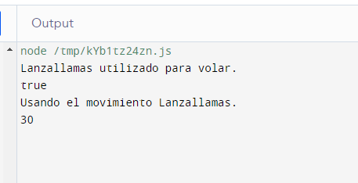

# Javascript

**Preguntas Conceptuales**

* *En JavaScript, todas las operaciones de red son asíncronas. ¿Porque es esto importante?*
***Respuesta***: Es importante para evitar bloqueos en la ejecución del código mientras se espera que se completen operaciones de red. Es decir, esto permite que el programa continúe ejecutándose y responda a otras interacciones mientras espera que se complete una operación de red.

* *En Javascript, queremos realizar acciones tras una operación/solicitud de red completa. ¿Qué paradigma de programación hace esto posible?*
***Respuesta***: El paradigma de programación que hace esto posible es la `programación asincrónica`. En JavaScript, se utiliza comúnmente el patrón de devolución de llamada (`callback`) o promesas para manejar operaciones asíncronas, lo que permite ejecutar código después de que se complete una operación de red.

* *¿Javascript proporciona soporte limitado para la herencia a través de qué mecanismo?*
***Respuesta***: JavaScript proporciona soporte para la herencia a través de prototipos.

* *¿Qué es el DOM? ¿Qué librería nos ayuda a usar Javascript para manipular el DOM?*
***Respuesta***: Es una interfaz de programación que representa la estructura de documentos HTML y XML como un árbol de objetos, donde cada nodo del árbol representa una parte del documento.

**Booleano**
Debido a cómo se escriben las variables de forma dinámica y flexible, hay valores que evalúan True/False cuando se convierten en Booleanos, pero cuando se comparan entre sí, pueden evaluarse o no como verdaderos.

Hay siete valores "Falsy" en Javascript. "Falsy" significa que se evalúan como falso en condicionales: 0 (Number), 0n (BigInt), null (palabra clave), undefined (palabra clave), false (Booleano), NaN (Number), "" (String). Sin embargo, estos valores no son necesariamente iguales entre sí.

1. `undefined == null`: **Verdadero**. Ambos representan la ausencia de valor y son tratados como iguales en comparaciones no estrictas `(===).`

2. `NaN == NaN`: **Falso**. NaN (No es un número) y como no es un número, es cualquier cosa. No es posible comparar cualquier cosa de un lado con cualquier cosa en el otro lado, por lo que nada garantiza que ambos son iguales.

3. `null == false`: **Falso**. Aunque ambos pueden evaluarse como falsos, no son iguales en una comparación estricta `(===)`.

4. `0 == false`: **Verdadero**. En comparaciones no estrictas `(===)`, el valor numérico 0 y el valor booleano false son considerados iguales.

5. `"" == false`: **Verdadero**. Similar al caso anterior, una cadena vacía y false son considerados iguales.

*Nota: A diferencia del operador de igualdad `(==)`, el operador de igualdad estricta siempre considera que operandos de diferentes tipos son diferentes.*

**Arrays**
Los arrays son una de las estructuras de datos centrales en Javascript, pero se comportan de maneras interesantes. En este ejercicio, veremos algunos de los comportamientos relativamente extraños de las operaciones tradicionales con arrays. ¡Trata de justificar también por qué ese comportamiento es así!.

1. `[1, 2, 3] + [4, 5, 6]`: **"1,2,34,5,6"**. En este caso, los arrays se convierten a cadenas y se concatenan en lugar de sumarse elemento por elemento.

2. `!![]`: **Verdadero**. El operador de negación doble convierte el array vacío a un valor booleano (`true`) y luego nega ese valor, resultando en true.

3. `[] == true`: **Falso**. En comparaciones no estrictas, un array vacío se convierte a 0, y true se convierte a 1, por lo que la comparación es falsa.

4. `[10, 1, 3].sort()`: **[1, 10, 3]**. El método `sort` ordena los elementos del array como cadenas de texto por defecto.

5. `[] == 0`: **Verdadero**. Similar al caso anterior, en una comparación no estricta, un array vacío se convierte a 0.

*Notas: El método `sort` ordena elementos como cadenas, por lo que los resultados pueden no ser los esperados para números.*

**Clausuras**
Un paradigma popular en Javascript es el uso de clausuras. Al igual que las funciones de orden superior en Python, las clausuras son combinaciones de una función agrupada con referencias a su estado circundante. Las clausuras le dan acceso al alcance de una función externa desde una función interna. Determina la salida del siguiente código.

~~~javascript
function f1(x) {
  var baz = 3;
  return function (y) {
    console.log(x + y + (baz++));
    }
}
var bar = f1(5);
bar(11);
~~~

***Respuesta*** : Se define la funcion `f1` que toma un argumento `x` y dentro de esta funcion se declara una variable local `baz` con valor igual a 3. Esta funcion retorna otra funcion interna que toma como argumento `y` y realiza la impresion de la siguiente suma `x + y + (baz++)`.

*¿Que sucede?* Primero se crea la variable `bar`, donde se llama a la funcion `f1(5)`, entonces x=5 y baz=3, luego este retorna la funcion interna. Finalmente, se hace `bar(11)`, entonces y=11, se hace la impresion de la suma `5 + 11 + 3` que es 19.

**Algoritmos**
La siguiente función encuentra el mayor número dentro de un array, pero tiene una eficiencia de O(N^2). Reescribe la función para que se convierta en una O(N) más rápida:

~~~javascript
function greatestNumber(array) {
    for (let i of array) {
        let isIValTheGreatest = true;

        for (let j of array) {
            if (j > i) {
                isIValTheGreatest = false;
            }
        }

        if (isIValTheGreatest) {
            return i;
        }
    }
}
~~~
**Respuesta**: Lo que hace la funcion anterior es encontrar el mayor numero en un array. Para poder obtener una complejidad `O(N)`, podedmos iterar una sola vez el array comparando cada elemento con la variable `max` y si encontramos un elemento mayor, actualizamos el `max`.
~~~javascript
function greatestNumber(array) {
    //Si el array esta vacio
    if (array.length === 0) {
        return undefined;
    }

    // Supongamos que el primer elemento es el máximo
    let max = array[0];

    for (let i = 1; i < array.length; i++) {
        if (array[i] > max) {
            // Actualizamos el máximo si encontramos un valor mayor
            max = array[i];
        }
    }

    return max;
}
~~~
La siguiente función devuelve si hay o no una X mayúscula dentro de una cadena.
~~~javascript
function containsX(string) {
    foundX = false;
    for(let i = 0; i < string.length; i++) {
        if (string[i] === "X") {
            foundX = true;
        }
    }
    return foundX;
}
~~~
¿Cuál es la complejidad temporal de esta función en términos de notación O grande? Luego, modifica el código para mejorar la eficiencia del algoritmo en los mejores y promedios escenarios.
La complejidad temporal de la función `containsX` en términos de notación O grande es `O(N)`, donde N es la longitud de la cadena. Esto se debe a que la función itera a través de cada carácter de la cadena para buscar la presencia de la letra `"X"`.
~~~javascript
function containsX(string) {
    for (let i = 0; i < string.length; i++) {
        if (string[i] === "X") {
            return true; // Tan pronto como se encuentra la "X", se devuelve true
        }
    }
    return false; // Si no se encuentra ninguna "X", se devuelve false
}
~~~
Para mejorar la eficiencia del algoritmo, hacemos que se detenga la búsqueda tan pronto como se encuentre la primera "X". Esto mejora el rendimiento en el mejor escenario (cuando la "X" está al principio de la cadena) y en el promedio, ya que no es necesario seguir recorriendo toda la cadena si ya se encontró la "X".

Escribe una función que devuelva el primer carácter no duplicado de una cadena. Por ejemplo, la cadena "mínimum" tiene dos caracteres que solo existen una vez: la `n` y la `u`, por lo que su función debería devolver la `n`, ya que aparece primero. La función debe tener una eficiencia de `O(N)`.
~~~javascript
function firstNonDuplicateChar(string) {
    const charCount = new Map();

    // Contar ocurrencias de cada carácter
    for (let char of string) {
        charCount.set(char, (charCount.get(char) || 0) + 1);
    }

    // Encontrar el primer carácter no duplicado
    for (let char of string) {
        if (charCount.get(char) === 1) {
            return char; // Devolver el primer carácter no duplicado
        }
    }

    return null; // Devolver null si no hay caracteres no duplicados
}
~~~
Utilizaremos un map (`charCount`) para contar las ocurrencias de cada carácter y luego busca el primer carácter con una ocurrencia única. La complejidad de este algoritmo es `O(N)`, ya que recorremos la cadena dos veces.

**Clases**
Practiquemos la herencia y la programación orientada a objetos en Javascript. Diseñe 2 clases, una llamada "Pokemon" y otra llamada "Charizard". Las clases deben hacer lo siguiente:
`Clase Pokémon:`
- El constructor toma 3 parámetros (HP, ataque, defensa)
- El constructor debe crear 6 campos (HP, ataque, defensa, movimiento, nivel, tipo). Los valores de (mover, nivelar, tipo) debe inicializarse en ("", 1, "").
- Implementa un método flight que arroje un error que indique que no se especifica ningún movimiento.
- Implementa un método canFly que verifica si se especifica un tipo. Si no, arroja un error. Si es así, verifica si el tipo incluye "volar". En caso afirmativo, devuelve verdadero; si no, devuelve falso.

~~~javascript
class Pokemon {
    constructor(HP, ataque, defensa) {
        this.HP = HP;
        this.ataque = ataque;
        this.defensa = defensa;
        this.movimiento = "";
        this.nivel = 1;
        this.tipo = "";
    }

    flight() {
        if (!this.movimiento) {
            throw new Error("No se especifica ningún movimiento.");
        }
        console.log(`${this.movimiento} utilizado para volar.`);
    }

    canFly() {
        if (!this.tipo) {
            throw new Error("No se especifica ningún tipo.");
        }
        return this.tipo.includes("volar");
    }
}
~~~

`Clase Charizard:`

- El constructor toma 4 parámetros (HP, ataque, defensa, movimiento)
- El constructor configura el movimiento y el tipo (para "disparar/volar") además de establecer HP, ataque y defensa como el constructor de superclase.
- Sobreescribe el método fight. Si se especifica un movimiento, imprime una declaración que indique que se está utilizando el movimiento y devuelve el campo de ataque. Si no, arroja un error.

~~~javascript
// Clase Charizard que hereda de Pokemon
class Charizard extends Pokemon {
    constructor(HP, ataque, defensa, movimiento) {
        super(HP, ataque, defensa);
        this.movimiento = movimiento;
        this.tipo = "disparar/volar";
    }

    fight() {
        if (this.movimiento) {
            console.log(`Usando el movimiento ${this.movimiento}.`);
            return this.ataque;
        }else {
            throw new Error("No se especifica ningún movimiento.");
        }
    }
}
~~~

~~~javascript
// Ejemplo
const myCharizard = new Charizard(100, 30, 20, "Lanzallamas");
myCharizard.flight();
console.log(myCharizard.canFly());
console.log(myCharizard.fight());
~~~

