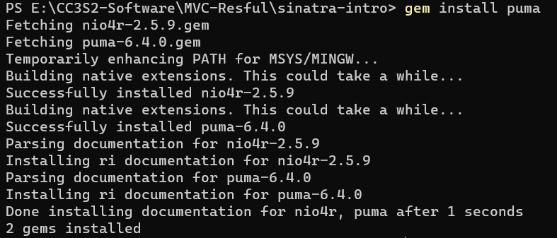
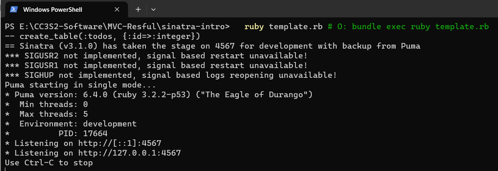
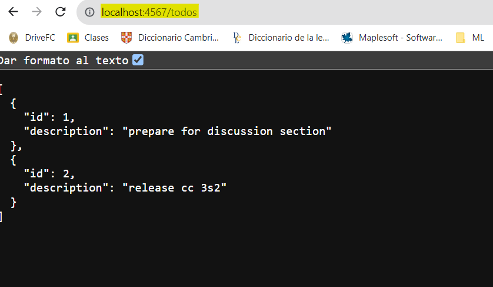

# Demostracion de MVC, rutas RESTful y CRUD con Sinatra

## Integrantes
`1. Espinoza Pari, Franklin`

`2. De la cruz Valdiviezo, Pedro Luis David`

`3. Azaña Vega, Luis Angel`

## Sinatra
Sinatra es un framework de aplicacion web escrito en Ruby. Es un ligero framework que permite a los desarrolladores 
crear rapidamente aplicaciones web y APIs. Ademas, sigue un enfoque minimalista, y provee un simple y elegante DSL
(Domain-Specific Language) para definir rutas y manejar solicitudes HTTP.

### Instalamos las dependencias
~~~
  cd sinatra-intro/
  bundle install
  ruby template.rb # O: bundle exec ruby template.rb
~~~

Pero esto botara el siguiente error de carga *(load error)*
~~~
-- create_table(:todos, {:id=>:integer})
C:/Ruby32-x64/lib/ruby/gems/3.2.0/gems/rack-2.2.8/lib/rack/handler.rb:45:in `pick': Couldn't find handler for: puma, falcon, thin, HTTP, webrick. (LoadError)
        from C:/Ruby32-x64/lib/ruby/gems/3.2.0/gems/sinatra-3.1.0/lib/sinatra/base.rb:1583:in `run!'
        from C:/Ruby32-x64/lib/ruby/gems/3.2.0/gems/sinatra-3.1.0/lib/sinatra/main.rb:47:in `block in <module:Sinatra>'
~~~
Enfoquemonos en lo siguiente

`Couldn't find handler for: puma, falcon, thin, HTTP, webrick. (LoadError)`

Este error nos da a entender que Sinatra no pudo encontrar un **web server** para poder ejecutar nuestra aplicacion.

Para solucionarlo, instalaremos el servidor **puma**. Para esto podemos agregar `gem 'puma'` en nuestro *gemfile* o
sino desde el terminal con el siguiente comando `gem install puma`.

Ahora podemos ejecutar el `template.rb`

~~~
ruby template.rb # O: bundle exec ruby template.rb
~~~

Se crea una tabla `todos_db`
Sinatra toma el puerto 4567 por defecto para el modo desarrollo.

Pegamos el siguiente URL en nuestro navegador favorito `http://localhost:4567/todos`.

**Opeacion Index**

Luego, utiliza el método `all` de la clase `Todo` para devolver una lista de todos los objetos 
en la base de datos.

~~~ruby
get '/todos' do
  content_type :json
  Todo.all.to_json
end
~~~

Mientras que el servidor sigue conectado, podemos ejecutar el siguiente comando para verificar que la aplicacion
se esta ejecutando localmente y responde solicitudes. 

`curl http://localhost:4567/todos`

Este comando activa una solicitud `GET` de la operación `Index` la cual nos mostrara la lista de objetos de la clase `Todo`
en nuestro shell.

## Parte 1
Lo primero que vamos a hacer es crear un modelo. A diferencia de Rails, Sinatra no tiene MVC integrado, así que vamos a piratear el nuestro. Usaremos ActiveRecord sobre una base de datos SQLite. En esta aplicación, ¿cuál será nuestro modelo y qué operaciones CRUD le aplicaremos?

- **Operacion index** devolverá una lista de todas las tareas.
~~~ruby
get '/todos' do
  content_type :json
  Todo.all.to_json
end
~~~
- **Operacion create** creará una nueva tarea.
~~~ruby
get '/todos/:id' do
  content_type :json
  todo = Todo.find(params[:id])
  if todo
    return {description: todo.description}.to_json
  else
    return {msg: "error: specified todo not found"}.to_json
  end
end
~~~ 
- **Operacion read** devolverá una tarea específica.
~~~ruby
  post '/todos' do
  content_type :json

  # Obtenemos la descripción de la tarea.
  description = params[:description]

  # Si la descripción de la tarea no está vacía, creamos una nueva tarea y
  # una respuesta JSON con el mensaje "create success".
  if description.present?
  Todo.create(description: description)
  return { msg: 'create success' }.to_json
  else
  # Si la descripción de la tarea está vacía, renderizamos una respuesta JSON con el mensaje "error: description can't be blank".
  return { msg: 'error: description can\'t be blank' }.to_json
  end
end
~~~ 
- **Operacion update** actualizará una tarea existente.
~~~ruby
put '/todos/:id' do
  content_type :json
  # Obtenemos el ID de la tarea
  id = params[:id]
  # Obtenemos la descripción de la nueva tarea
  description = params[:description]

  # Buscamos la tarea en la base de datos
  todo = Todo.find(id)

  # Si la tarea existe y la descripción no esta vacia
  if todo and description != ""
    todo.update_attribute(:description, description)
    return { msg: 'update success' }.to_json
  else
    return { msg: 'update failure' }.to_json
  end
end
~~~
- **Operacion destroy** eliminará una tarea existente.
~~~ruby
delete '/todos/:id' do
  content_type :json
  # Obtenemos el ID de la tarea
  id = params[:id]

  # Buscamos la tarea en la base de datos
  todo = Todo.find(id)

  # Si la tarea no existe
  if todo.nil?
    return { msg: 'delete failure' }.to_json
  else
    # Si la tarea eiste
    todo.destroy
    return { msg: 'delete success' }.to_json
  end
end
~~~

## Parte 2
A continuación, creemos algunas rutas para que los usuarios puedan interactuar con la aplicación. Aquí hay una URL de ejemplo:

`https://www.etsy.com/search?q=test#copy`

Especifica qué partes de la URL son componentes según la discusión sobre la forma de una URL. Consulta esta publicación de IBM que detalla los componentes de una URL.

- **https://** : Este es el esquema, este indentifica el protocolo que se utilizará para acceder al recurso en Internet.
- **etsy** : El nombre del host identifica el host que contiene el recurso.
- **443** : Este es un puerto conocido, que entrega el servicio HTTP con capa de sockets seguros (SSL)
- **/search** : Este el `path`, esta ruta identifica el recurso especifico en el host a la cual el cliente web desea acceder.
- **q=test** : Este es una cadena de consulta, este proporciona una cadena de informacion que el recurso puede usar para algun proposito, por ejemplo parametros para una busqueda.
- **copy** : Este es un identificador de fragmento, es usado para señalar  para señalar a un navegador web una **referencia o función** en el elemento que acaba de recuperar.  

### RESTful
Para las rutas RESTful que estamos declarando, podemos utilizar las siguientes acciones:

- **Listar** : La acción RESTful para listar tareas pendientes es `GET`. Esta acción devuelve una lista de todas las tareas pendientes.
- **Crear** : La acción RESTful para crear una tarea pendiente es `POST`. Esta acción crea una nueva tarea pendiente.
- **Editar** : La acción RESTful para editar una tarea pendiente es `PUT`. Esta acción actualiza una tarea pendiente existente.
- **Eliminar** : La acción RESTful para eliminar una tarea pendiente es `DELETE`. Esta acción elimina una tarea pendiente existente.

## Parte 3

***Dado que HTTP es un protocolo RESTful, cada solicitud debe ir seguida de una respuesta, por lo que debemos devolver una vista o redirigir a cada solicitud. Usaremos JSON para las respuestas, que es similar a lo que hacen muchas API. ¿Hacia dónde debería ir la respuesta?.***

Dado que estamos usando JSON para las respuestas, la respuesta debe ir al cliente. El cliente es el programa o aplicación que está haciendo la solicitud HTTP. El cliente puede usar el JSON para procesar la respuesta y tomar las medidas adecuadas.

En el caso de nuestra aplicación de tareas pendientes, el cliente podría ser un navegador web, una aplicación móvil o un cliente de API. El navegador web podría usar el JSON para actualizar una lista de tareas pendientes en una página web. La aplicación móvil podría usar el JSON para crear una nueva tarea pendiente. El cliente de API podría usar el JSON para realizar una operación CRUD en una tarea pendiente.