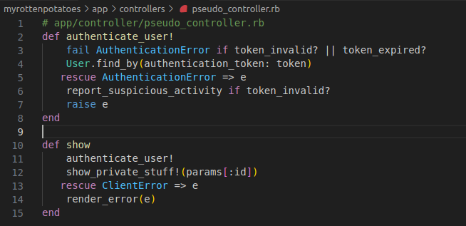

# Actividad: codigo limpio, manejo de excepciones, depuracion

# Pasos de la actividad

## Paso 1

En este apartado se implemento las buenas practicas segun leido en el articulo web proporcionado, todo fue hecho en base al proyecto `myrottenpotatoes`.
A continuacion, dare un concepto y la importancia de las 3 buenas practicas:

* **Mantenibilidad**: Nos permite poder encontrar y corregir facilmente nuevos errores, sin el temor de quiza romper la funcionalidad, introducir muchos mas errores o aun peor tener que abandonar el codigo por completo debido al aumento de la complejidad con el tiempo. Es importante ya que garantiza que el codigo pueda ser mejorado y gestionado a largo plazo sin muchas dificultades.

* **Extensabilidad**: Nos permite poder agregar facilmente nuevas funciones al codigo fuente base, implementando nuevos requisitos o modificando los existentes sin afectar la funcionalidad actual. Es importante ya que proporciona flexibilidad y facilita la reutilizacion de codigo.

* **Legibilidad**: Nos permite leer facilmente el codigo y comprender su proposito sin tener que estar dedicandole demasiado tiempo. Es importante ya que nos permite descubrir errores mas facilmente, y contribuye a un mantenimiento del codigo a largo plazo.

Ahora mostrare los puntos que se muestran en el articulo web.
# Siempre crea tu propia jerarquia `ApplicationError` 
Nos dice que cuando ocurre errores, lo que se utiliza son excepciones para manejarlos. Segun el articulo, sugiere crear nuestra propia jerarquia de excepciones personalizadas para poder hacer que nuestro codigo sea mas mantenible, legible.

* **Ejemplo de Jerarquia**
~~~ruby
class ApplicationError < StandardError; end

# Errores de validacion
class ValidationError < ApplicationError; end

class RequiredFieldError < ValidationError; end
class UniqueFieldError < ValidationError; end

# Errores de respuesta HTTP 4xx
class ResponseError < ApplicationError; end

class BadRequestError < ResponseError; end
class UnauthorizedError < ResponseError; end
# ...
~~~
Luego nos muestra un ejemplo practico, donde por ejemplo estamos manejando los errores de validacion y respuesta HTTP. Como realizamos nuestra jerarquia, podemos ahora leer y manejar los errores de manera mas eficiente sin tener que enumerar cada posible error.
~~~ruby
rescue ValidationError => e
# es mucho mas facil de leer que ...
rescue RequiredFieldError, UniqueFieldError, ... => e
~~~
Desde la perspectiva de **matenibilidad**, si por ejemplo implementamos una API JSON y definimos nuestro propio `ClientError` con distintos subtipos, que seran usados cuando un cliente envia una solicitud incorrecta, es mucho mas facil corregir o agregar logica a un solo bloque que maneje `ClienteError` en lugar de repetir el mismo codigo para cada error posible.

A continuacion, crearemos el archivo `app/controllers/pseudo_controller.rb`. Y pegaremos el codigo proporcionado en el articulo web.

# Nunca `rescue Exception`

