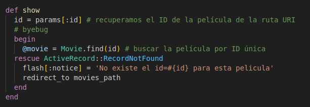
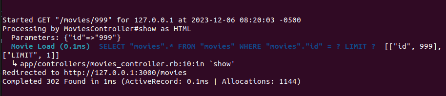
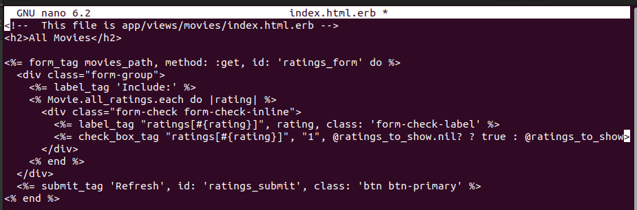
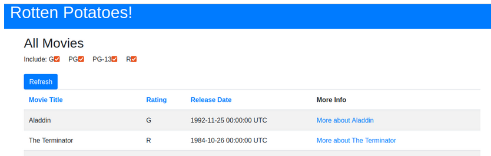

# Practica Calificada 5
- - - 
* Franklin Espinoza Pari 20210135D
- - -
## Preguntas (Parte 01):
1. En las actividades relacionados a la Introducción de Rails los métodos actuales del controlador no son muy robustos: si el usuario introduce de manera manual un URI para ver (Show) una película que no existe (por ejemplo /movies/99999), verás un mensaje de excepción horrible. Modifica el método show del controlador para que, si se pide una película que no existe, el usuario sea redirigido a la vista Index con un mensaje más amigable explicando que no existe ninguna película con ese.     En las actividades relacionados a la Introducción de Rails los métodos actuales del controlador no son muy robustos: si el usuario introduce de manera manual un URI para ver (Show) una película que no existe (por ejemplo /movies/99999), verás un mensaje de excepción horrible. Modifica el método show del controlador para que, si se pide una película que no existe, el usuario sea redirigido a la vista Index con un mensaje más amigable explicando que no existe ninguna película con ese. En las actividades relacionados a la Introducción de Rails los métodos actuales del controlador no son muy robustos: si el usuario introduce de manera manual un URI para ver (Show) una película que no existe (por ejemplo /movies/99999), verás un mensaje de excepción horrible. Modifica el método show del controlador para que, si se pide una película que no existe, el usuario sea redirigido a la vista Index con un mensaje más amigable explicando que no existe ninguna película con ese. 

***Respuesta:***
i. Vamos a clonar el repositorio realizado en clase.

ii. Vamos a verificar si existe la pelicula con el id de parametro utilizando `rescue ActiveRecord::RecordNotFound`. Se genera cuando Active Record no puede 
encontrar un registro mediante una `id` dado.

iii. Luego, utilizaremos el `flash[:notice]` para mandar un mensaje mas amigable a la excepcion. De ser este el caso, vamos a redirigir a la vista `index` con `redicrect_to movies_path`.

Al querer ingresar al registro con id `/999`, este al no existir nos manda un error horrible. Sin embargo; ahora nos redigira a la vista `index` y lanzara un mensaje mas amigable.

Podemos observar en la consola lo siguiente:

2. En las actividades relacionados a Rails Avanzado, si tenemos el siguiente ejemplo de código que muestra cómo se integra OmniAuth en una aplicación Rails:

~~~ruby
class SessionsController < ApplicationController
    def create
        @user = User.find_or_create_from_auth_hash(auth_hash)
        self.current_user = @user
        redirect_to '/'
        end
    protected
    def auth_hash
        request.env['omniauth.auth']
        end
    end
~~~

***Respuesta:***

Debido a que sera utilizado varias veces, definimos un metodo con el `request.env['omniauth.auth']` para autorizar a mi aplicacion Rails con `OAuth`. Hacemos uso del metodo para la reutilizacion de codigo, una mejor claridad, y legibilidad. Del mismo modo, si queremos agregar lineas de codigo o modificar la logica pordemos hacerlo solamente cambiando el metodo `auto_hash`.

3. En las actividades relacionados a JavaScript, Siguiendo la estrategia del ejemplo de jQuery utiliza JavaScript para implementar un conjunto de casillas de verificación (checkboxes) para la página que muestra la lista de películas, una por cada calificación (G, PG, etcétera), que permitan que las películas correspondientes permanezcan en la lista cuando están marcadas. Cuando se carga la página por primera vez, deben estar marcadas todas; desmarcar alguna de ellas debe esconder las películas con la clasificación a la que haga referencia la casilla desactivada.

***Respuesta:***

Para esta actividad vamos a clonar la actividad realizada para Javascript. Luego, nos ubicamos a la pagina que muestra la lista de peliculas, es decir la vista `index`. El objetivo es implementar un conjunto de checkboxes para cada calificacion (G, PG, ...) y estas tienen que estar todas marcadas al principio.

Vamos agregar la siguiente linea de codigo en la vista:

Le decimos que para cada calificacion, crearemos un checkbox `check_box_tag`.
~~~erb
<% Movie.all_ratings.each do |rating| %>
      

        <%= label_tag "ratings[#{rating}]", rating, class: 'form-check-label' %>
        <%= check_box_tag "ratings[#{rating}]", "1", @ratings_to_show.nil? ? true : @ratings_to_show>
      

    <% end %>
~~~

4. De la actividad relacionada a BDD e historias de usuario crea definiciones de pasos que te permitan escribir los siguientes pasos en un escenario de RottenPotatoes:

5. 

## Preguntas (Parte 02):

## Preguntas (Parte 03):

1. Describa uno o más patrones de diseño que podrían ser aplicados al diseño del sistema.

Algunos patrones para `ActiveWorkflow`:

* `Patrón Observer`: Dado que "ActiveWorkflow" trabaja con funcionalidades impulsadas por eventos, este patrón es aplicable ya que permite reaccionar a cambios de estado o a la aparición de eventos específicos.

* `Patrón de Agente`: La plataforma utiliza agentes que son servicios autónomos (o microservicios). Estos agentes pueden ser diseñados utilizando el patrón de agente, que actúa de manera independiente o en conjunto para realizar tareas.

* `Patrón de Estrategia`: Para la ejecución periódica y la lógica de negocio agrupada, el patrón de estrategia podría ser utilizado para intercambiar algoritmos de ejecución sin cambiar el código cliente.

2. Dado un sistema simple que responde a una historia de usuario concreta, analice y elija un paradigma de diseño adecuado 

En mi opinion, podemos utilizar el paradigma orientada a servicios (SOA) para `ActiveWorkflow`, ya que esta gestiona y conecta servicios que pueden estar escritos en cualquier lenguaje de programacion, y lo que es una caracteristica principal del paradigma orientada a servicios.

3. Analice y elija una arquitectura software apropiada que se ajuste a una historia de usuario concreta de este sistema. ¿La implementación en el sistema de esa historia de usuario refleja su idea de arquitectura? 

En mi opinion, podemos utilizar la arquitectura basada en microservicios ya que tambien es apliamente utilizada en `ActiveWorkflow`. Cada agente va actuar como un microservicio independiente que puede ser programado, monitoreado y conectado a otros agentes. Esto permite una gran escalabilidad del sistema.

