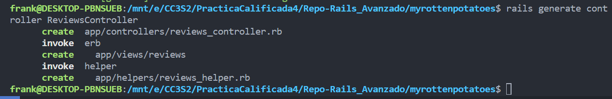

# Practica Calificada N4
*by Franklin Espinoza P.*

## Preguntas - Parte 1
1. 
**Solucion**

Para implementar el comando `grep` trabajamos en el archivo `grep.js`. Aqui, vamos a utilizar `fs` (file system) para poder leer y procesar lineas. Ademas, para los indicadores se utilizan expresiones regulares.

~~~javascript
#!/usr/bin/env node

const fs = require('fs');

// Obtenemos los argumentos de la línea de comandos con `process.argv.slice()`
const args = process.argv.slice(2);

// Obtenemos la cadena de búsqueda y los indicadores 
const cadena_buqueda = args.shift();
constindicadores = {
    // inicializamos todos como falsos
    '-n': false,
    '-l': false,
    '-i': false,
    '-v': false,
    '-x': false,
};

// Procesamos los indicadores con el metodo filter
args = args.filter(arg => {
  if indicadores[arg]) {
    indicadores[arg] = true;
    return false;
  }
  return true;
});

function grep(fileContent, fileName) {
  const lines = fileContent.split('\n');
  for (let i = 0; i < lines.length; i++) {
    // Leemos cada linea
    let line = lines[i];
    // Aplicamos la logica para cada indicador
    if indicadores['-i']) {
      line = line.toLowerCase();
      cadena_buqueda = cadena_buqueda.toLowerCase();
    }

    if (indicadores['-x'] && line === cadena_buqueda) || line.includes(cadena_buqueda)) {
      if indicadores['-n']) {
        line = `${i + 1}:${line}`;
    }

    // Mostramos el nombre del archivo
    if indicadores['-l']) {
        console.log(fileName);
        return;
    }
    console.logindicadores['-l'] ? fileName : line);

    } else if indicadores['-v'] && indicadores['-l']) {
        console.logindicadores['-l'] ? fileName : line);
    }
  }
}

// hacemos el proceso para cada archivo
args.forEach(fileName => {
    try {
        const fileContent = fs.readFileSync(fileName, 'utf8');
        grep(fileContent, fileName);
    } catch (error) {
        console.error(`Error al leer el archivo ${fileName}: ${error.message}`);
    }
});
~~~

2. Practiquemos la herencia y la programación orientada a objetos en Javascript. Diseña 2 clases, una llamada "Pokemon" y otra llamada "Charizard". Las clases deben hacer lo siguiente:
**Clase Pokémon:**
* El constructor toma 3 parámetros (HP, ataque, defensa)
* El constructor debe crear 6 campos (HP, ataque, defensa, movimiento, nivel, tipo). Los valores de (mover, nivelar, tipo) debe inicializarse en ("", 1, "").
* Implementa un método flight que arroje un error que indique que no se especifica ningún movimiento.
* Implementa un método canFly que verifica si se especifica un tipo. Si no, arroja un error. Si es así, verifica si el tipo incluye ‘’flying’. En caso afirmativo, devuelve verdadero; si no, devuelve falso.

~~~ruby
class Pokemon {
    constructor(HP, ataque, defensa) {
        this.HP = HP;
        this.ataque = ataque;
        this.defensa = defensa;
        this.movimiento = "";
        this.nivel = 1;
        this.tipo = "";
    }

    flight() {
        if (!this.movimiento) {
            throw new Error("No se especifica ningún movimiento.");
        }
        console.log(`${this.movimiento} utilizado para volar.`);
    }

    canFly() {
        if (!this.tipo) {
            throw new Error("No se especifica ningún tipo.");
        }
        return this.tipo.includes("flying");
    }
}
~~~

***Explicacion:*** Se crea el contrusctor con los parametros `HP`, `ataque`, `defensa`. Ademas se asignan los campos anteriores correspondientes, ademas asignando nuevos campos `movimiento`, `nivel`, y `tipo` con los siguientes valores `""`, `1`, """ respectivamente (Usamos `this` para asignar a la instancia). Luego vemos dos metodos `flight` y `canFly`. En cada uno se utiliza un condicional que valida si existe el movimiento o si existe el tipo, de no ser asi se manda un mensaje error respectivamente. Sino, imprimi el movimiento a volar y retorna si el tipo incluye `"flying"`.

**Clase Charizard:**
* El constructor toma 4 parámetros (HP, ataque, defensa, movimiento)
* El constructor configura el movimiento y el tipo (para "disparar/volar") además de establecer HP, ataque y defensa como el constructor de superclase.
* Sobreescribe el método fight . Si se especifica un movimiento, imprime una declaración que indique que se está utilizando el movimiento y devuelve el campo de ataque. Si no arroja un error.  (implementa utilizando JavaScript )  (1 punto).

~~~ruby
# Clase Charizard que hereda de Pokemon
class Charizard extends Pokemon {
    constructor(HP, ataque, defensa, movimiento) {
        super(HP, ataque, defensa);
        this.movimiento = movimiento;
        this.tipo = "disparar/volar";
    }

    fight() {
        if (this.movimiento) {
            console.log(`Usando el movimiento ${this.movimiento}.`);
            return this.ataque;
        }else {
            throw new Error("No se especifica ningún movimiento.");
        }
    }
}
~~~

***Explicacion:*** Creamos nuetra clase `Charizard` que hereda de `Pokemon`, ademas creamos su constructor con los parametros `(HP, ataque, defensa, movimiento)`. Usamos `super` para referirnos a la clase padre `Pokemon` (superclase) cambiando los parametros de `(HP, ataque, defensa)`. Luego asignamos el campo de movimiento y el tipo como `disparar/volar` (Usamos `this` para asignar a la instancia). Se sobreescribe el metodo `flight`, donde usaremos una condicional para validar si existe el movimiento, se lanzara un error si no es asi.

***resultados***
~~~javascript
// Ejemplo
const myCharizard = new Charizard(100, 30, 20, "Lanzallamas");
myCharizard.flight();
console.log(myCharizard.canFly());
console.log(myCharizard.fight());
~~~

3. 
**Solucion**
El problema que observo es que en la clase `CurrentDay` tiene una dependencia con la clase `MonthlySchedule`. Por lo tanto, esto hace complicado probar el metodo `workday?` de una manera individual, ya que siempre dependera de la logica en `MonthlySchedule` y de la fecha del sistema.

Para solucionar este problema, podemos aplicar la inyeccion de dependencias para facilitar las pruebas. A continuacion, veremos el codigo proporcionado modificado.

~~~ruby
class CurrentDay
  def initialize(schedule)
    @date = Date.today
    @schedule = schedule
  end

  def work_hours
    @schedule.work_hours_for(@date)
  end

  def workday?
    !@schedule.holidays.include?(@date)
  end
end
~~~

Ahora no instanciamos de la clase `MonthlySchedule` en el constructor, sino que vamos a recibir una instancia del mismo como parametro.
~~~ruby
before do
    Date.singleton_class.class_eval do
        alias_method :_today, :today
        define_method(:today){Date.new(2020, 12, 16)}
    end
end
after do
    Date.singleton_class.class_eval do
        alias_method :today, :_today
        remove_method :_today
    end	
end
~~~

Utilizamos la inyeccion de depedencia en el codigo anterior. El codigo utiliza `Date.today` pero se va modificar la fecha a una especifica (`Date.new(2020, 12, 16)`) para la ejecucion de pruebas.

***¿Qué sucede en JavaScript con el DIP en este ejemplo? (1 punto).***
DIP se refiere a la idea de que los modulos de alto nivel no deben depender de los modulos de bajo nivel, sino que ambos deben depender de abstracciones. Y en el codigo anterior, no utilizamos DIP ya que estamos modificando el comportamiento de la clase `Date`, esto vendria a ser una dependencia directa en lugar de abstraccion.

Podemos aplicarlo pasando la dependecia `Date` como un parametro. Esto permitira una mayor felixibilidad y facilita las pruebas.

## Pregunta - Repo: Introduccion a Rails
Clonamos el reporsitorio `Introduccion a Rails`.
* a. Modifica la vista Index para incluir el número de fila de cada fila en la tabla de películas.

~~~
-# add to end of index.html.haml
 
= link_to 'Add new movie', new_movie_path

%h1 All Movies

%table#movies
  %thead
    %tr
      %th Nro
      %th Movie Title
      %th Rating
      %th Release Date
      %th More Info
  %tbody
    - @movies.each do |movie|
      %tr
        %td= movie.id
        %td= movie.title 
        %td= movie.rating
        %td= movie.release_date
        %td= link_to "More about #{movie.title}", movie_path(movie)
~~~
* b. Modifica la vista Index para que cuando se sitúe el ratón sobre una fila de la tabla, dicha fila cambie temporalmente su color de fondo a amarillo u otro color.
## Pregunta - Repo: Rails Avanzado
Clonamos el repositorio utilizando en la actividad hecha en clase `Rails Avanzado`.
Luego vamos a modificar los metodos `edit` y `update`. Como vimos el clase debemos agregar la logica de autorizacion para que un usuario solo pueda editar o actualizar sus propias criticas.

Vamos a crear un controlador para las criticas (`Reviews`) utilizando el siguiente comando:
~~~
rails generate controller ReviewsController
~~~

Luego vamos a modificar el archivo, pegando lo proporcionado en la practica. A continuacion se muestra el controlador Reviews.

