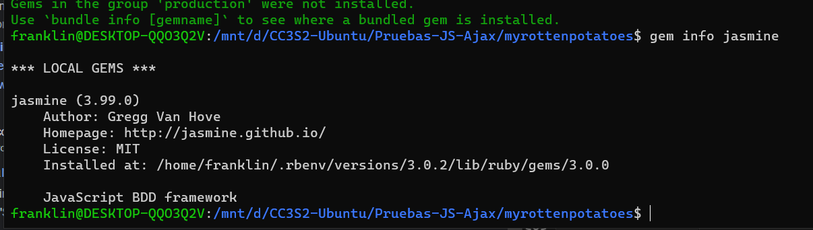
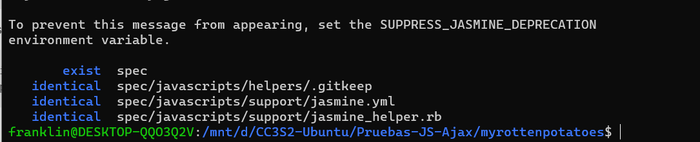
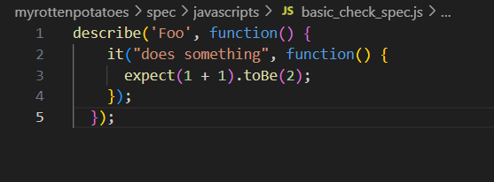
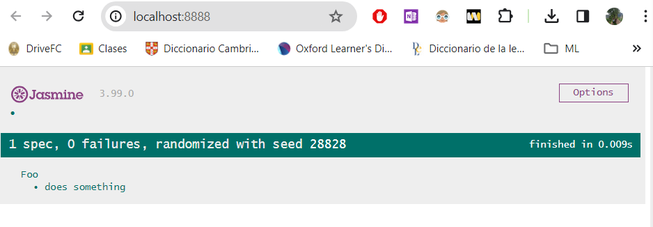

# Testing Java Script y Ajax
Vamos agregar la gema `gem 'jasmine-rails'` a nuestro gemfile, ejecutaremos `bundle install`.



Luego vamos a ejecutar el siguiente comando generador de rails `rails generate jasmine:install`.



El generador creara el archivo de configuracion llamado `jasmine.yml`, en `spec/javascript/support`. El archivo `jasmine.yml` tiene configuraciones sobre que archivos deberian ser cargados a la hora de cargar la pagina que ejecuta las pruebas. A continuacion, se muestra el contenido del archivo `jasmine.yml`.
```yml
# src_files
#
# Return an array of filepaths relative to src_dir to include before jasmine specs.
# Default: []
#
# EXAMPLE:
#
# src_files:
#   - lib/source1.js
#   - lib/source2.js
#   - 'dist/**/*.js'
#
src_files:
  - assets/application.js

# stylesheets
#
# Return an array of stylesheet filepaths relative to src_dir to include before jasmine specs.
# Default: []
#
# EXAMPLE:
#
# stylesheets:
#   - css/style.css
#   - 'stylesheets/*.css'
#
stylesheets:
  - assets/application.css

# helpers
#
# Return an array of filepaths relative to spec_dir to include before jasmine specs.
# Default: ["helpers/**/*.js"]
#
# EXAMPLE:
#
# helpers:
#   - 'helpers/**/*.js'
#
helpers:
  - 'helpers/**/*.js'

# spec_files
#
# Return an array of filepaths relative to spec_dir to include.
# Default: ["**/*[sS]pec.js"]
#
# EXAMPLE:
#
# spec_files:
#   - '**/*[sS]pec.js'
#
spec_files:
  - '**/*[sS]pec.js'

# src_dir
#
# Source directory path. Your src_files must be returned relative to this path. Will use root if left blank.
# Default: project root
#
# EXAMPLE:
#
# src_dir: public
#
src_dir:

# spec_dir
#
# Spec directory path. Your spec_files must be returned relative to this path.
# Default: spec/javascripts
#
# EXAMPLE:
#
# spec_dir: spec/javascripts
#
spec_dir:

# spec_helper
#
# Ruby file that Jasmine server will require before starting.
# Returned relative to your root path
# Default spec/javascripts/support/jasmine_helper.rb
#
# EXAMPLE:
#
# spec_helper: spec/javascripts/support/jasmine_helper.rb
#
spec_helper: spec/javascripts/support/jasmine_helper.rb

# boot_dir
#
# Boot directory path. Your boot_files must be returned relative to this path.
# Default: Built in boot file
#
# EXAMPLE:
#
# boot_dir: spec/javascripts/support/boot
#
boot_dir:

# boot_files
#
# Return an array of filepaths relative to boot_dir to include in order to boot Jasmine
# Default: Built in boot file
#
# EXAMPLE
#
# boot_files:
#   - '**/*.js'
#
boot_files:

# rack_options
#
# Extra options to be passed to the rack server
# by default, Port and AccessLog are passed.
#
# This is an advanced options, and left empty by default
#
# EXAMPLE
#
# rack_options:
#   server: 'thin'

# phantom_cli_options
#
# Extra options to be passed to the phantomjs cli,
# e.g. to enable localStorage in PhantomJs 2.5
#
# EXAMPLE
#
# phantom_cli_options:
#   local-storage-quota: 5000

# random
#
# Run specs in semi-random order.
# Default: true
#
# EXAMPLE:
#
# random: false
#
random:
```

Vamos a crear un archivo de prueba simple `spec/javascripts/basic_check_spec.js` con el codigo proporcionado.



y luego ejecutaremos el comando `rake jasmine` para iniciar un servidor que continua ejecutandose para que podamos visualizarlo con un navegador.


- - -
***Pregunta:*** ¿Cuáles son los problemas que se tiene cuando se debe probar Ajax?. Explica tu respuesta.

***Respuesta:*** Cuando queremos realizar pruebas utilizando el framework de unidad de testeo, `Jasmine`, para nuestro codigo `AJAX`, existe el problema de asincronia. Este se debe a que como sabemos las llamadas `AJAX` son operaciones asincronas, lo que significa que el ejecutador de pruebas de `Jasmine` puede continuar ejecutandose antes que la llamada `AJAX` se complete. Del mismo modo, como sabemos las pruebas `Jasmine` son generalmente de manera sincronica, por lo que necesitamos asegurar que las pruebas esperen el tiempo suficiente para que las llamadas `AJAX` se completen.
- - -
***Pregunta:*** ¿Qué son los `Stubs`, `Spies` y `fixture` en Jasmine para realizar pruebas de Ajax?

***Respuesta:*** Son herramientas que se utilizan para poder realizar pruebas de manera efectiva. Los `Stubs` son funciones falsas que reemplazan a las reales durante las pruebas, en las pruebas AJAX se pueden utilizar para simular llamadas al servidor y controlar las respuestas. Los `Spies` son funciones que regristran informacion sobre las llamadas, como por ejemplo cuantas veces se llamaron, con que argumentos, etc; en las pruebas AJAX se utilizan para verificar si se llaman correctamente y obtener informacion sobre las llamadas. Lo `Fixture` se utilizan para simular respuestas reales del servidor durante las pruebas de AJAX. Por ejemplo, Podemos cargar datos simulados en lugar de depender del servidor real.
- - -
***Pregunta:*** ¿Que hacen las siguientes líneas del código anterior?. ¿Cuál es el papel de spyOn de Jasmine y los stubs en el código dado.
~~~javascript
it('calls correct URL', function() {
      spyOn($, 'ajax');
      $('#movies a').trigger('click');
      expect($.ajax.calls.mostRecent().args[0]['url']).toEqual('/movies/1');
    });
~~~
***Respuesta:*** A continuacion, daremos una breve descripcion sobre cada linea.
* **`SpyOn($, 'ajax')`**: Se utiliza `SpyOn` para poder realizar un seguimiento al metodo `$.ajax`. Esto nos permitira verificar si una funcion se ha llamado, la cantidad y con que argumento.

* **`$('#movies a').trigger('click')`**: Simula un click en un enlace dentro del elemento con el ID `movies`.

* **`expect($.ajax.calls.mostRecent().args[0]['url']).toEqual('/movies/1')`**: Esta linea verifica que la llamada mas reciente a `$.ajax` haya tenido un argumento `url` igual a `'/movies/1'`.
- - -
***Pregunta:*** ¿Que hacen las siguientes líneas del código anterior?.

~~~javascript
 let htmlResponse = readFixtures('movie_info.html');
        spyOn($, 'ajax').and.callFake(function(ajaxArgs) { 
          ajaxArgs.success(htmlResponse, '200');
        });
        $('#movies a').trigger('click');
      });
      it('makes #movieInfo visible', function() {
        expect($('#movieInfo')).toBeVisible();
      });
      it('places movie title in #movieInfo', function() {
        expect($('#movieInfo').text()).toContain('Casablanca');
~~~
***Respuesta:*** A continuacion, daremos una breve descripcion sobre cada linea.

* **`let htmlResponse = readFixtures('movie_info.html');`:** Se está utilizando `readFixtures` para cargar el contenido del archivo `movie_info.html` en la variable `htmlResponse`. Esto simula una respuesta HTML que probablemente se obtendría a través de una llamada AJAX.

* **`spyOn($, 'ajax').and.callFake(function(ajaxArgs) { ajaxArgs.success(htmlResponse, '200'); });`:** Esta línea utiliza `spyOn` de Jasmine para espiar la función `$.ajax()`. Se utiliza `and.callFake` para proporcionar una función falsa (fake) que reemplaza la implementación real de `$.ajax()`. La función falsa simula una llamada AJAX exitosa, invocando la función de éxito (`success`) con el contenido HTML simulado (`htmlResponse`) y el código de estado '200'.

* **`$('#movies a').trigger('click');`:** Este código simula un clic en un enlace dentro del elemento con el ID `movies`. Se está activando un evento de clic en este elemento.

* **`it('makes #movieInfo visible', function() { expect($('#movieInfo')).toBeVisible(); });`:** Esta es una afirmación de Jasmine que verifica que el elemento con el ID `movieInfo` es visible después de la simulación del clic. Se está probando si la acción de clic (simulada) en el enlace dentro de `#movies` ha llevado a que `#movieInfo` sea visible.

* **`it('places movie title in #movieInfo', function() { expect($('#movieInfo').text()).toContain('Casablanca'); });`:** Otra afirmación de Jasmine que verifica que el contenido de `#movieInfo` contiene el texto 'Casablanca'. Esto confirma que la simulación del clic ha activado una llamada AJAX simulada, y el contenido de la película (en este caso, el título 'Casablanca') se ha colocado correctamente en `#movieInfo`.
- - -
***Pregunta:*** Dado que Jasmine carga todos los ficheros JavaScript antes de ejecutar ningún ejemplo, la llamada a setup (línea 34 del codigo siguiente llamado movie_popup.js)ocurre antes de que se ejecuten nuestras pruebas, comprueba que dicha función hace su trabajo y muestra los resultados.

~~~javascript
var MoviePopup = {
  setup: function() {
    // add hidden 'div' to end of page to display popup:
    let popupDiv = $('<div id="movieInfo"></div>');
    popupDiv.hide().appendTo($('body'));
    $(document).on('click', '#movies a', MoviePopup.getMovieInfo);
  }
  ,getMovieInfo: function() {
    $.ajax({type: 'GET',
            url: $(this).attr('href'),
            timeout: 5000,
            success: MoviePopup.showMovieInfo,
            error: function(xhrObj, textStatus, exception) { alert('Error!'); }
            // 'success' and 'error' functions will be passed 3 args
           });
    return(false);
  }
  ,showMovieInfo: function(data, requestStatus, xhrObject) {
    // center a floater 1/2 as wide and 1/4 as tall as screen
    let oneFourth = Math.ceil($(window).width() / 4);
    $('#movieInfo').
      css({'left': oneFourth,  'width': 2*oneFourth, 'top': 250}).
      html(data).
      show();
    // make the Close link in the hidden element work
    $('#closeLink').click(MoviePopup.hideMovieInfo);
    return(false);  // prevent default link action
  }
  ,hideMovieInfo: function() {
    $('#movieInfo').hide();
    return(false);
  }
};
$(MoviePopup.setup);  
~~~
***Respuesta:*** A continuacion, se mostrara los fragmentos de codigo para dar una breve explicacion.

La función setup en `movie_popup.js` ejecuta las acciones iniciales requeridas para presentar detalles sobre las películas. Esta función genera un contenedor oculto (`div`) denominado `#movieInfo` destinado a mostrar la información y configura un evento de clic en los enlaces de las películas.

~~~javascript
var MoviePopup = {
    setup: function() {
        let popupDiv = $('<div id="movieInfo"></div>');
        popupDiv.hide().appendTo($('body'));
        $(document).on('click', '#movies a', MoviePopup.getMovieInfo);
    },
};

$(MoviePopup.setup);
~~~

Para comprobar la efectividad de esta función, podemos llevar a cabo pruebas para asegurarnos de que el div `#movieInfo` se genere, se oculte y se añada al cuerpo del documento, además de confirmar que se configure un evento de clic en los enlaces de las películas.

~~~javascript
  ,showMovieInfo: function(data, requestStatus, xhrObject) {
    // center a floater 1/2 as wide and 1/4 as tall as screen
    let oneFourth = Math.ceil($(window).width() / 4);
    $('#movieInfo').
      css({'left': oneFourth,  'width': 2*oneFourth, 'top': 250}).
      html(data).
      show();
    // make the Close link in the hidden element work
    $('#closeLink').click(MoviePopup.hideMovieInfo);
    return(false);  // prevent default link action
  }
  ,hideMovieInfo: function() {
    $('#movieInfo').hide();
    return(false);
  }
};
~~~
La función `showMovieInfo` en el código es responsable de presentar la información de una película en una ventana emergente. Primero, se calculan las dimensiones y la posición para centrar la ventana emergente en la pantalla. Luego, se ajustan los estilos y se carga el contenido de la película en el div `#movieInfo`, que se muestra posteriormente. Además, se vincula el evento de clic en el enlace "Close" para llamar a la función `hideMovieInfo` y ocultar la ventana emergente cuando se hace clic en él.

La función `hideMovieInfo` simplemente oculta el div `#movieInfo`, proporcionando así la capacidad de cerrar la ventana emergente y mantener una experiencia de usuario más intuitiva.
- - -
***Pregunta:*** Indica cuales son los stubs y fixtures disponibles en Jasmine y Jasmine-jQuery.

***Respuesta:***

**Stubs en Jasmine:** Los stubs en Jasmine son funciones simuladas que reemplazan el comportamiento de funciones reales durante las pruebas. Pueden ser creados utilizando funciones proporcionadas por Jasmine, como `jasmine.createSpy`, permitiendo que las pruebas controlen y evalúen la ejecución de las funciones simuladas.

**Fixtures en Jasmine-jQuery:** Jasmine-jQuery facilita el manejo de fixtures, que son datos simulados o entornos controlados utilizados en pruebas. Funciones como `loadFixtures` permiten cargar datos simulados, mientras que `readFixtures` facilita la lectura de información desde fixtures. Estos recursos son útiles para establecer condiciones predefinidas y reproducibles durante las pruebas.
- - -
***Pregunta:*** Como en RSpec, Jasmine permite ejecutar código de inicialización y desmantelamiento de pruebas utilizando beforeEach y afterEach. El código de inicialización carga el fixture HTML mostrado en el código siguiente, para imitar el entorno que el manejador getMovieInfo vería si fuera llamado después de mostrar la lista de películas.

~~~html
<div id="movies">
  <div class="row">
    <div class="col-8"><a href="/movies/1">Casablanca</a></div>
    <div class="col-2">PG</div>
    <div class="col-2">1943-01-23</div>
  </div>
</div>
~~~
En Jasmine, el código de preparación se incluye en un bloque `beforeEach` y se emplea para establecer el entorno requerido antes de cada prueba. En este escenario, carga un fixture HTML simulado que representa la lista de películas. Posterior a cada prueba, se puede utilizar `afterEach` para realizar acciones de limpieza si es necesario, asegurando la independencia entre las pruebas. Este enfoque posibilita simular el entorno que el manejador `getMovieInfo` percibiría al hacer clic en un enlace después de mostrar la lista de películas.


