# Ruby on Rails - Avanzado
*by Franklin Espinoza P. 20210135D*
# Vistas parciales, validaciones y filtros
Las **vistas parciales** en Ruby on Rails podemos verlos como segmentos de vistas reutilizables que se pueden renderizar en otras vistas. Las vistas parciles se diferencias por empezar su nombre por un guion bajo `_movie.html.erb`. Crearemos la vista parcial `_movies.html.erb` en el directorio `app/views/movies/`, donde copiamos el siguiente codigo:
~~~html

    
 <%= link_to movie.title, movie_path(movie) %> 

    
 <%= movie.rating%> 

    
 <%= movie.release_date.strftime('%F') %> 

~~~

Las **validaciones** son una parte crucial en el desarrollo ya que nos asegura que los datos ingresados en la aplicacion cumplan con ciertos criterios. Para poder hacer esto nos dirigimos primero a `app/models/movie.rb`, y pegamos el siguiente codigo que lleva los criterios que deseeamos.
~~~ruby
class Movie < ActiveRecord::Base
    def self.all_ratings ; %w[G PG PG-13 R NC-17] ; end #  shortcut: array of strings
    validates :title, :presence => true
    validates :release_date, :presence => true
    validate :released_1930_or_later # uses custom validator below
    validates :rating, :inclusion => {:in => Movie.all_ratings},
        :unless => :grandfathered?
    def released_1930_or_later
        errors.add(:release_date, 'must be 1930 or later') if
        release_date && release_date < Date.parse('1 Jan 1930')
    end
    @@grandfathered_date = Date.parse('1 Nov 1968')
    def grandfathered?
        release_date && release_date < @@grandfathered_date
    end
end

begin
class Movie < ActiveRecord::Base
    before_save :capitalize_title
    def capitalize_title
        self.title = self.title.split(/\s+/).map(&:downcase).
        map(&:capitalize).join(' ')
    end
end
~~~

Antes de continuar con la comprobacion de consola rails, tenemos que realizar la migracion para asi poder interactuar con la base de datos y realizar cambios. Entonces, generaremos los archivos de migracion para la tabla mymoviegoers con el siguiente comando `rails generate migration CreateMoviegoers`.

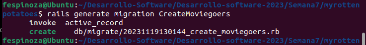

Como podemos vissular, se creo el archivo siguiente.

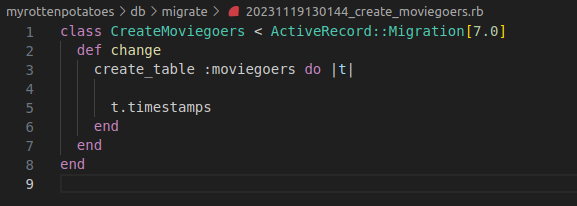

Finalmente, nos faltaria ejecutar la migracion.

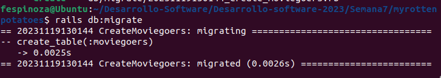

Ahora si, veremos los resultados en consola. Para esto crearemos un nuevo registro de pelicula donde a proposito colocamos sus datos para que realize o ejecute las validaciones.

Pasaremos ahora a explicar el siguiente codigo:
~~~ruby
class MoviesController < ApplicationController
  def new
    @movie = Movie.new
  end 
  def create
    if (@movie = Movie.create(movie_params))
      redirect_to movies_path, :notice => "#{@movie.title} created."
    else
      flash[:alert] = "Movie #{@movie.title} could not be created: " +
        @movie.errors.full_messages.join(",")
      render 'new'
    end
  end
  def edit
    @movie = Movie.find params[:id]
  end
  def update
    @movie = Movie.find params[:id]
    if (@movie.update_attributes(movie_params))
      redirect_to movie_path(@movie), :notice => "#{@movie.title} updated."
    else
      flash[:alert] = "#{@movie.title} could not be updated: " +
        @movie.errors.full_messages.join(",")
      render 'edit'
    end
  end
  def destroy
    @movie = Movie.find(params[:id])
    @movie.destroy
    redirect_to movies_path, :notice => "#{@movie.title} deleted."
  end
  private
  def movie_params
    params.require(:movie)
    params[:movie].permit(:title,:rating,:release_date)
  end
end
~~~
* `new`: Prepara una nueva instancia de la película para ser creada.

* `create`: Crea una nueva película utilizando los parámetros proporcionados. Redirige a la lista de películas si la creación tiene éxito; de lo contrario, muestra mensajes de error.

* `edit`: Busca y prepara una película existente para su edición.

* `update`: Actualiza una película existente con los parámetros proporcionados. Redirige a la página de detalles de la película si la actualización tiene éxito; de lo contrario, muestra mensajes de error.

* `destroy`: Busca y elimina una película existente. Redirige a la lista de películas después de la eliminación.

* `movie_params`: Es método privado que define los parámetros permitidos para la creación y actualización de películas. Este utiliza el método `permit` para especificar qué atributos de la película pueden ser modificados a través de formularios web.

Ahora vamos a comprobar el mecanismo de `canonicalizar` los campos antes de guardar el modelo. Para ello vimos anteriormente el siguiente codigo dentro del archivo `movie.rb`.
~~~ruby
class Movie < ActiveRecord::Base
    before_save :capitalize_title
    def capitalize_title
        self.title = self.title.split(/\s+/).map(&:downcase).
        map(&:capitalize).join(' ')
    end
end
~~~

Ahora realizamos la comprobacion, para esto abrimos la consola denuevo y vamos a crear ahora una nueva pelicula con los siguientes argumentos:
~~~
m = Movie.create!(:title => 'STAR  wars', :release_date => '27-5-1977', :rating => 'PG')
~~~
Extraemos el titulo, donde observaremos que se ha modificado correctamente.
~~~
m.title  # => "Star Wars"
~~~

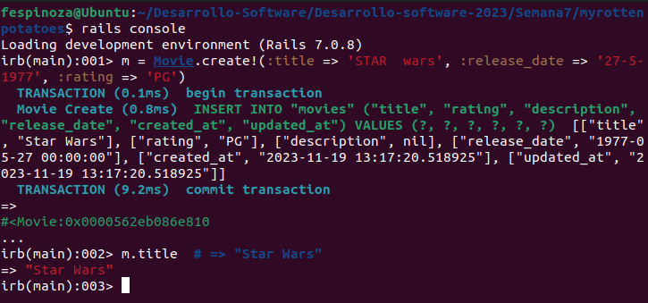

Ahora finalmente para esta seccion veremos el apartado de **filtros** en Ruby on Rails. Un filtro es un método que evalúa condiciones antes de ejecutar una acción o establecer condiciones comunes para múltiples acciones. Si las condiciones no se cumplen, el filtro puede *interrumpir* la ejecución, mostrando una plantilla de vista o redirigiendo a otra acción. Si las condiciones son satisfactorias, la acción continúa su ejecución normal y es responsable de proporcionar una respuesta. Veremos el codigo proporcionado.
~~~ruby
class ApplicationController < ActionController::Base
    before_filter :set_current_user
    protected # prevents method from being invoked by a route
    def set_current_user
        # we exploit the fact that the below query may return nil
        @current_user ||= Moviegoer.where(:id => session[:user_id])
        redirect_to login_path and return unless @current_user
    end
end
~~~
Observamos que en el codigo existe un filtro llamado `set_current_user`, este filtro se ejecuta antes de cualquier accion en los controladores.Este intenta asegurarse de que haya un usuario actual autenticado.Si no se encuentra un usuario, redirige a la página de inicio de sesión (`login_path`). 

# SSO y autenticación a través de terceros

Primero, vamos a generar un modelo y una migracion.
~~~
rails generate model Moviegoer name:string provider:string uid:string
rails db:migrate
~~~
Editamos el archivo generado en `app/models/moviegoer.rb`.
~~~ruby
# Edit app/models/moviegoer.rb to look like this:
class Moviegoer < ActiveRecord::Base
    def self.create_with_omniauth(auth)
        Moviegoer.create!(
        :provider => auth["provider"],
        :uid => auth["uid"],
        :name => auth["info"]["name"])
    end
end
~~~

Durante la siguiente seccion vamos *autenticar a los usuarios* a través de un proveedor externo utilizando la gema **OmniAuth**, que ofrece una interfaz unificada para diversos proveedores de inicio de sesión único (SSO). Se detallarán los ajustes necesarios en *rutas*, *controladores* y *vistas* para implementar OmniAuth en la aplicación.
* `routes.rb`

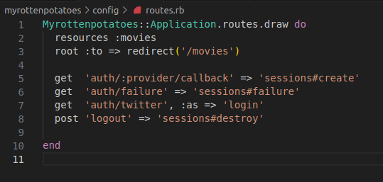

* `session_controller.rb`: Vamos a crear el controlador para que pueda manejar las sesiones.

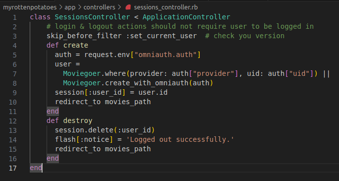

Para utilizar la autenticación a través de proveedores como Twitter, debemos registrarnos en la aplicación en el sitio del proveedor para obtener `API_KEY`y `API_SECRET`.Vamos a ilustrar cómo crear una cuenta de desarrollador en Twitter. 

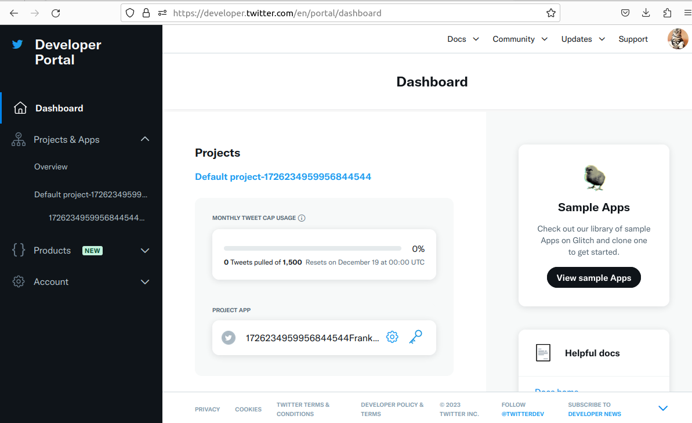

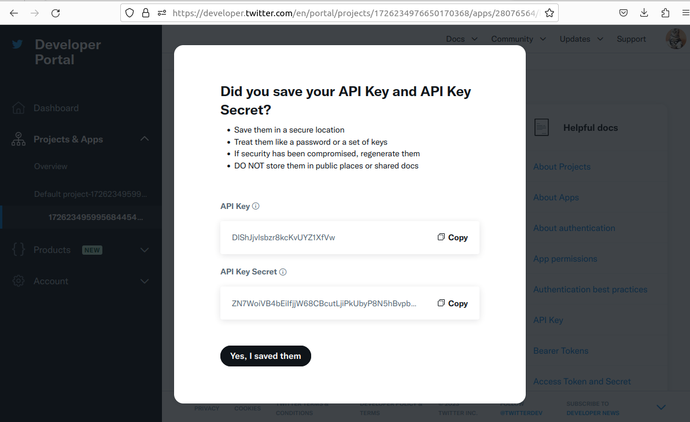

Muy bien, entonces ahora que tenemos nuestras llaves, ahora vamos a modificar en el archivo de configuracion `initializers/omniauth.rb`.

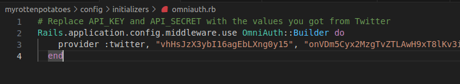

***Pregunta***: *Debes tener cuidado para evitar crear una vulnerabilidad de seguridad. ¿Qué sucede si un atacante malintencionado crea un envío de formulario que intenta modificar params[:moviegoer][:uid] o params[:moviegoer][:provider] (campos que solo deben modificarse mediante la lógica de autenticación) publicando campos de formulario ocultos denominados params[moviegoer][uid] y así sucesivamente?.*

***Respuesta**: Si un agresor trata de alterar `params[:moviegoer][:uid]` o `params[:moviegoer][:provider]` a través de campos de formulario ocultos manipulados, existe el riesgo de abrir una vulnerabilidad de seguridad. Esto podría poner en peligro la información del usuario.

# Asociaciones y claves foráneas

Una asociación es una relación lógica entre dos tipos de entidades de una arquitectura software. Por ejemplo, podemos añadir a RottenPotatoes las clases Review (crítica) y Moviegoer (espectador o usuario) para permitir que los usuarios escriban críticas sobre sus películas favoritas; podríamos hacer esto añadiendo una asociación de uno a muchos (one-to-many) entre las críticas y las películas (cada crítica es acerca de una película) y entre críticas y usuarios (cada crítica está escrita por exactamente un usuario).

Ahora, nos piden explicar las siguientes lineas de codigo SQL.
~~~sql
SELECT reviews.*
    FROM movies JOIN reviews ON movies.id=reviews.movie_id
    WHERE movies.id = 41;
~~~
***Respuesta***: Facil, la clausula `JOIN` busca coincidencias entre tablas, en este caso entre la tabla `movies` y `reviews`, donde guardan un campo o columna en comun que es el `id`. Ahora bien, luego tenemos la clausula `WHERE`, una vez realizada el JOIN se va a tomar aquellos registros que tengan `movies.id` =  **41**. Finalmente solo mostramos los campos o columnas de la tabla `reviews`.

Comprueba la implementación sencilla de asociaciones de hacer referencia directamente a objetos asociados, aunque estén almacenados en diferentes tablas de bases de datos. *¿Por que se puede hacer esto?*

~~~ruby
# it would be nice if we could do this:
inception = Movie.where(:title => 'Inception')
alice,bob = Moviegoer.find(alice_id, bob_id)
# alice likes Inception, bob less so
alice_review = Review.new(:potatoes => 5)
bob_review   = Review.new(:potatoes => 3)
# a movie has many reviews:
inception.reviews = [alice_review, bob_review]
# a moviegoer has many reviews:
alice.reviews << alice_review
bob.reviews << bob_review
# can we find out who wrote each review?
inception.reviews.map { |r| r.moviegoer.name } # => ['alice','bob']
~~~

***Respuesta:***  Esto es posible ya que Rails permite trabajar con objetos relacionados directamente, esto quiere decir que podemos interactuar con las relaciones entre diferentes entidades(como modelos de base de datos en este caso) utilizandolos como objetos en nuestro codigo, y asi ocultando la complejidad de las consultas SQL. Por ejemplo, en lugar de escribir consultas complicadas SQL para relacionar una pelicula con sus criticas, podemos hacer algo asi simplemente:
~~~ruby
inception = Movie.find_by(title: 'Inception')
alice_review = Review.new(potatoes: 5)
inception.reviews << alice_review
~~~
Porsupuesto, esto se traduce como un codigo mas limpio y comprensible donde los modelos se manejan como si estuvieras trabajando con objetos.

(a): Crea y aplica esta migración para crear la tabla Reviews. Las claves foraneas del nuevo modelo están relacionadas con las tablas `movies` y `moviegoers` existentes por convención sobre la configuración.

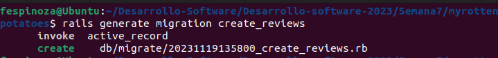

luego editamos `db/migrate/*_create_reviews.rb` con el codigo proporcionado.

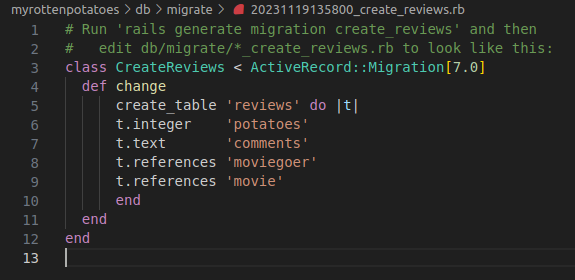

(b) Coloca este nuevo modelo de revisión en `app/models/review.rb`.

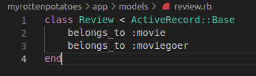

(c) Coloca una copia de la siguiente línea en cualquier lugar dentro de la clase Movie Y dentro de la clase Moviegoer (idiomáticamente, debería ir justo después de `class Movie` o `class Moviegoer`), es decir realiza este cambio de una línea en cada uno de los archivos existentes `movie.rb` y `moviegoer.rb`.

~~~ruby
has_many :reviews
~~~

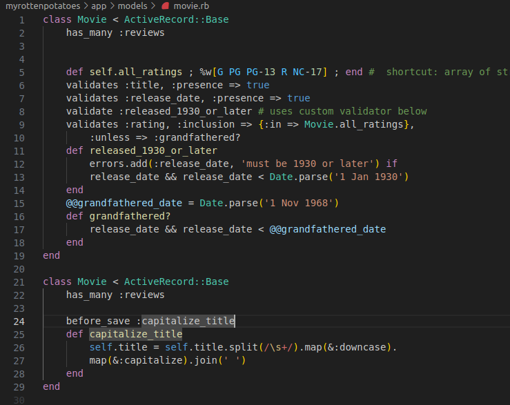

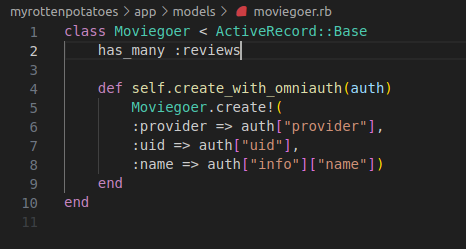

Finalmente, vamos a realizar la migracion.
~~~
rails db:migrate
~~~

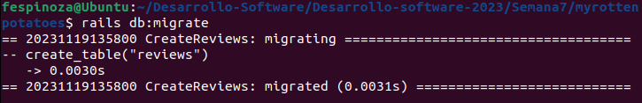

# Asociaciones Indirectas
Vamos ahora agregar `has_many :moviegoers, :through => :reviews` al modelo `Movie`, para establecer una conexión a través de las críticas. Posteriormente, al llamar `movie.moviegoers`, puedes obtener los usuarios asociados para una película específica.

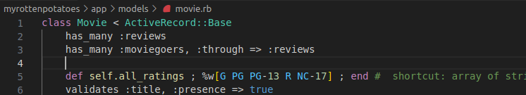

***Pregunta:*** *¿Qué indica el siguiente código SQL ?*
~~~sql
SELECT movies .*
    FROM movies JOIN reviews ON movies.id = reviews.movie_id
    JOIN moviegoers ON moviegoers.id = reviews.moviegoer_id
    WHERE moviegoers.id = 1;
~~~

***Respuesta***: Realizamos primero la clausula `JOIN` entre las tablas `movies` y `moviegoers` con la condicion de `movies.id=reviews.movie_id`, luego devuelta usamos la clausula `JOIN` con la tabla `moviegoers` con la condicion de `moviegoers.id=reviews.moviegoer_id`, y la relacion resultante vamos a filtrar a traves de la clausura `WHERE` con la condicion `moviegoers.id=1`. Finlamente, de la relacion resultante seleccionamos todas las columnas o campos de la tabla `movies`.
